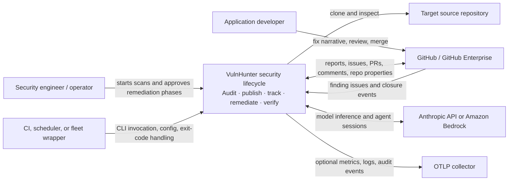
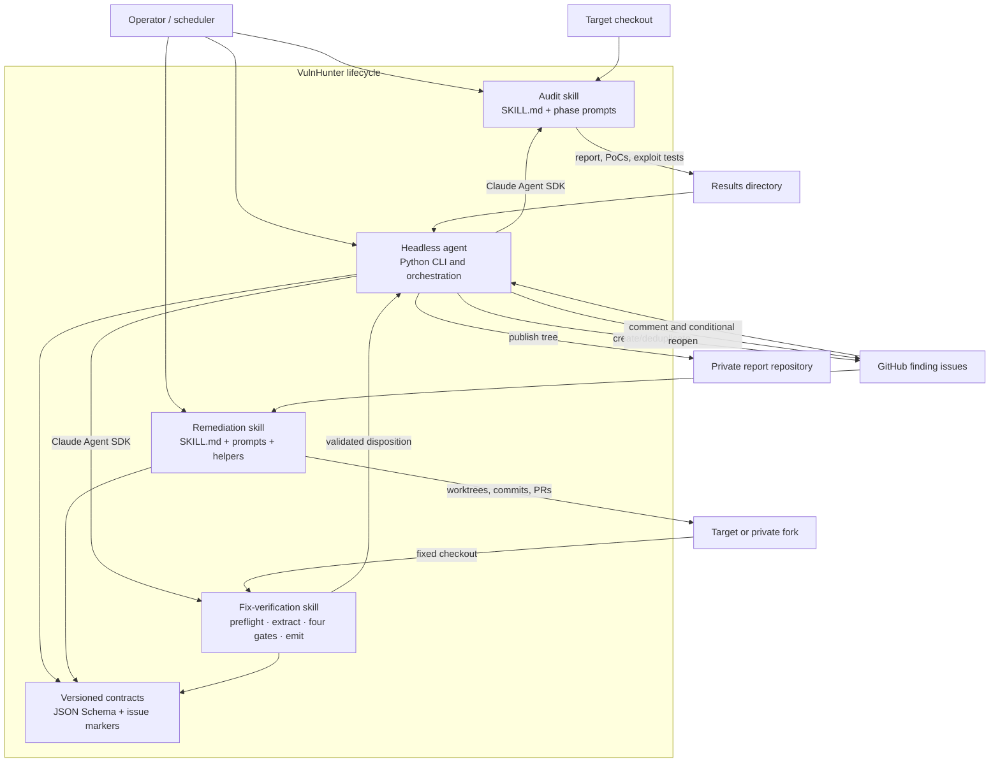
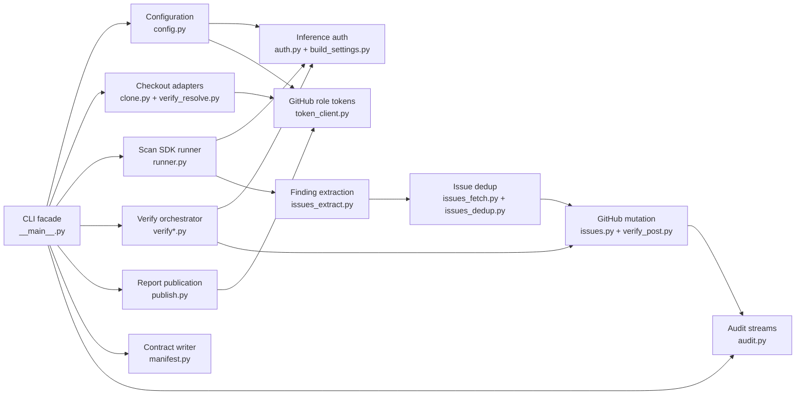
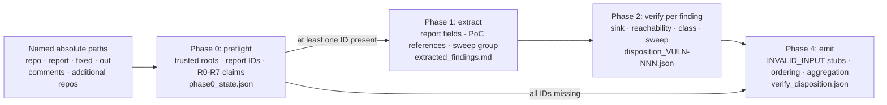
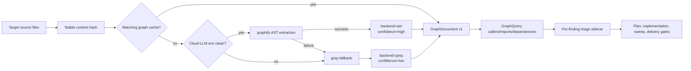
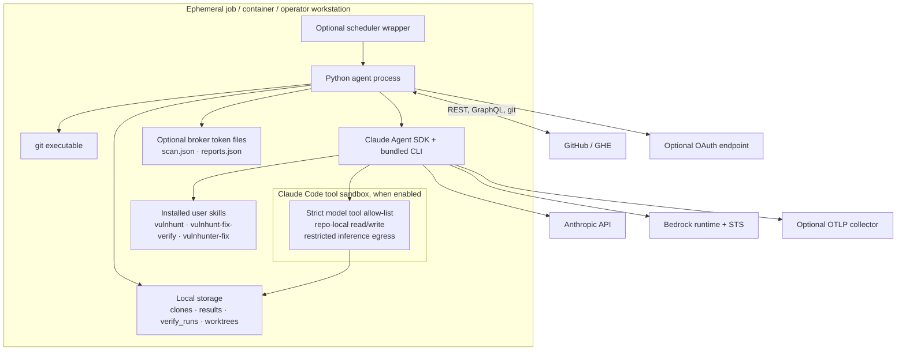

# VulnHunter architecture

Status: source-derived current-state documentation

Analyzed snapshot: 2026-08-01

Primary audience: security engineering, platform engineering, maintainers, and operators

This document describes the architecture implemented by the repository, not an
aspirational target state. Where prose and code disagree, the executable Python,
schemas, and skill instructions are treated as the strongest available evidence.
Known mismatches and deployment gaps are recorded in
[Quality and risks](quality-and-risks.md).

## 1. Documentation approach

The documentation combines established practices without forcing the system into
one notation:

- **arc42** supplies the section structure: goals, constraints, context, building
  blocks, runtime, deployment, cross-cutting concepts, decisions, quality, and risks.
- **C4** supplies the static system-context, container, and component views.
- **UML-style sequence diagrams** describe scan, verify, and remediation behavior.
- **ADR** captures decisions inferred from code, with evidence and consequences.
- **ISO/IEC 25010** organizes quality attributes and measurable scenarios.
- **STRIDE** structures the trust-boundary and threat-control review.

Related documents:

- [Runtime views](runtime-views.md)
- [Architecture decisions](decisions.md)
- [Quality attributes, threats, and risks](quality-and-risks.md)

## 2. Executive summary

VulnHunter is a security-finding lifecycle composed of four cooperating subsystems:

1. **`vulnhunt` audit skill** — prompt-only orchestration that partitions a target
   repository, dispatches specialized analysis agents, falsifies candidates, writes
   PoCs and exploit tests, sweeps for sibling instances, and compiles a Markdown
   report. It does not patch target source.
2. **`vulnhunter-agent` runtime** — a Python 3.12 command-line application that
   clones targets, launches the audit or verify skill through the Claude Agent SDK,
   publishes reports, deduplicates and opens GitHub issues, emits audit JSONL, and
   writes schema-validated machine contracts.
3. **`vulnhunter-fix` remediation skill** — prompt orchestration plus Python/shell
   helpers that ingest findings, plan and implement TDD fixes, analyze callers with
   an AST graph or grep fallback, sweep root causes, run fail-closed delivery gates,
   and create GitHub pull requests.
4. **`vulnhunt-fix-verify` verification skill** — a prompt-only, read-only methodology
   that validates its trusted roots, evaluates developer claims under R0–R7, extracts
   the requested findings, applies four static code-evidence gates per finding, and
   emits a v1 disposition document for the agent to validate and publish.

The architectural center is the **artifact pipeline** rather than a long-running
service. Git checkouts, reports, schemas, issue markers, worktrees, and disposition
files are the durable hand-off points. LLM sessions are replaceable execution
engines around those artifacts.

## 3. Goals and non-goals

### Goals

- Find exploitable, production-reachable security defects with concrete data-flow
  evidence and aggressive false-positive elimination.
- Run scans unattended in CI, scheduled jobs, fleet workers, or containers.
- Publish reports separately from target source and create deduplicated tracking
  issues.
- Remediate findings through a RED-to-GREEN test discipline and mechanically gate
  delivery quality.
- Verify fixes against a specific report and source checkout, then reflect the
  verdict in GitHub.
- Keep credentials, hosts, trust stores, model routes, and sandbox policy external
  to the runtime image.

### Non-goals

- The audit skill does not edit the scanned application.
- The Python agent is not a multi-tenant scheduler, queue consumer, web service, or
  report database. An outer platform must supply those concerns if needed.
- Remediation is not fully autonomous across phase boundaries; the interactive
  skill requires operator approval between phases.
- Static fix verification does not replay exploit tests in the current v1
  disposition contract.

## 4. System context (C4 level 1)

### People and external systems

| Actor/system | Responsibility | Interface |
|---|---|---|
| Security operator | Selects targets and models; opts into executable scans; approves remediation phases | CLI and Claude Code skill invocation |
| Application developer | Supplies fix evidence, reviews PRs, merges fixes | GitHub issues and pull requests |
| Scheduler/wrapper | Provides job discovery, isolation, retries, secrets, and status mapping | `python -m agent`, exit code, `scan_manifest.json` |
| Target repository | Untrusted code to analyze or fix | Git over HTTPS/SSH; local checkout |
| GitHub/GHE | Source hosting, report hosting, issue state, custom properties, PR delivery | Git and REST/GraphQL APIs |
| Inference provider | Runs the root agent, subagents, extraction, semantic dedup, and reference extraction | Claude Agent SDK via Anthropic API or Bedrock |
| OAuth endpoint | Optionally mints a bearer for a Bedrock proxy | OAuth2 client credentials |
| Token broker | Optionally refreshes GitHub identities into role-specific JSON files | Local `scan.json` and `reports.json` files |
| OTLP collector | Optionally receives Claude Code telemetry | OTLP/gRPC |

## 5. Constraints and assumptions

- The audit and remediation methodologies are implemented substantially in Markdown
  prompts. Prompt files are executable architecture and require the same review
  discipline as Python.
- Fix verification is also implemented as a prompt-only skill. It has no Bash or
  network tools and does not replay exploit tests; phase 3 is explicitly reserved for
  that future capability.
- Audit execution expects an Opus-class model; the headless runtime controls the
  configured model, while interactive skills enforce or request an operator choice.
- The agent requires Python 3.12+, `git`, the Claude Agent SDK, and installed user
  skills. The remediation helper package requires Python 3.11+ and `git`/`gh`.
- Scan mode accepts one repository per process. Verify mode accepts multiple issue
  URLs only when they are homogeneous for repository and originating results set.
- GitHub is the implemented collaboration system; hosts are configurable for GHE.
- Read-only scanning is the default. Bash becomes visible only when the operator
  supplies the paired `--no-read-only --enable-bash` flags.
- The Claude Code sandbox limits model tools, not the surrounding Python process.
  GitHub, OAuth, git publication, and token-file operations occur outside that tool
  sandbox and depend on the process/container boundary.
- The report is Markdown plus files. Findings are extracted from the report by an
  LLM before becoming structured `Finding` objects and a scan manifest.

## 6. Solution strategy

The implementation follows seven recurring strategies:

1. **Separate methodology from unattended execution.** Skills define the security
   process; the Python agent owns cloning, credentials, retries, publication, and API
   integration.
2. **Use explicit filesystem contracts.** Each phase must write named artifacts; the
   orchestrator verifies their presence before advancing.
3. **Constrain model authority.** The runtime supplies a strict tool visibility and
   approval allow-list, strips Bash by default, can apply an OS sandbox, and wraps
   untrusted developer content before verification.
4. **Fail closed at machine boundaries.** Manifests, verification dispositions,
   remediation plans, results, and sidecars use JSON Schema; critical delivery gates
   require non-empty invocations and valid inputs.
5. **Separate identities by role.** `scan` credentials access target repositories and
   issues; `reports` credentials access the report repository. Broker mode refreshes
   them per request without an in-agent cache.
6. **Prefer deterministic evidence, degrade explicitly.** Remediation caller analysis
   prefers an isolated AST backend and records high confidence; failures fall back to
   grep with low confidence rather than silently preserving an AST claim.
7. **Keep durable audit trails.** Reports, Git history, issue markers, JSONL events,
   scan manifests, verification logs, dispositions, test evidence, and PR bodies make
   each stage inspectable after the model session ends.

## 7. Container view (C4 level 2)

### Container responsibilities

| Container | Primary responsibility | Key implementation |
|---|---|---|
| Audit skill | Orchestrate recon, parallel hunts, adversarial verification, reproduction, sweep, report | [`vulnhunt/SKILL.md`](../../vulnhunt/SKILL.md), [`vulnhunt/phases/`](../../vulnhunt/phases/) |
| Headless agent | Run scan/verify workflows and integrate with external systems | [`agent/__main__.py`](../../vulnhunter-agent/agent/__main__.py) |
| Fix-verification skill | Independently inspect the fixed checkout, evaluate comments as untrusted claims, run four static gates, and emit per-finding verdicts | [`vulnhunt-fix-verify/SKILL.md`](../../vulnhunt-fix-verify/SKILL.md), [`comment_rules.md`](../../vulnhunt-fix-verify/comment_rules.md), [`phases/`](../../vulnhunt-fix-verify/phases/) |
| Remediation skill | Parse, plan, implement, verify, sweep, and deliver fixes | [`vulnhunter-fix/SKILL.md`](../../vulnhunter-fix/SKILL.md), [`prompts/`](../../vulnhunter-fix/prompts/) |
| Remediation helper library | Stable graph schema/query layer and delivery rendering/guards | [`vulnhunter_fix/`](../../vulnhunter-fix/vulnhunter_fix/) |
| Helper scripts | Deterministic validation, dispatch, worktree, parsing, scoring, graph, and gate operations | [`vulnhunter-fix/scripts/`](../../vulnhunter-fix/scripts/) |
| Contract set | Fail-closed exchange formats across agents and phases | [`scan_manifest.schema.json`](../../vulnhunter-agent/scan_manifest.schema.json), [`verify_disposition.schema.json`](../../vulnhunter-agent/verify_disposition.schema.json), [`references/`](../../vulnhunter-fix/references/) |

## 8. Headless-agent component view (C4 level 3)

The CLI is intentionally a process-level coordinator. Most modules expose narrow
adapters or pure transformation functions; no dependency-injection framework or
long-lived application container is used.

## 9. Building blocks

### 9.1 Audit skill

The root prompt acts only as a dispatcher and report compiler. It avoids loading full
phase outputs into its own context. The core fan-out is:

- Recon produces a partition table and input inventory.
- Hunt dispatches at least three vulnerability-class agents per partition plus one
  sink-driven agent.
- Verification attempts to disprove candidates.
- Reproduction assigns one finding ID per confirmed sink, then writes PoCs, exploit
  tests, and fix strategies.
- Sweep searches the entire codebase for the confirmed root-cause patterns.
- Report compilation reconciles candidate counts and exploit-test PASS counts.

See [the scan runtime view](runtime-views.md#scan-runtime).

### 9.2 Headless agent

The CLI has two explicit modes:

- `scan`: validate stage combinations and role credentials, clone or reuse a checkout,
  run the audit, optionally publish, optionally create issues, emit audit records, and
  persist a manifest.
- `verify`: fetch issue history, reconstruct original bodies, enforce homogeneous
  inputs, stage a target checkout and named report, resolve cross-repository evidence,
  run the verification skill once, validate its disposition, comment, and reopen when
  appropriate.

The short-lived JSON-only LLM client used for extraction and semantic comparison has
no tools or skills. It retries typed transient failures and may fall back to a second
model.

### 9.3 Fix-verification skill

The verification skill executes four phases over caller-staged local artifacts:

The trusted roots are the fixed target checkout plus explicitly supplied additional
checkouts. The report is a separate historical input. Developer comments are always
data: a well-formed wrapper can add trusted agent annotations outside the untrusted
region, while corrupt marker layouts fall back to treating the whole file as untrusted.

Per finding, the verifier checks:

1. `sink_mitigated` — the original or successor sink uses a safe API or a confirmed
   sanitization chokepoint.
2. `reachability` — the entry point still reaches the mitigated path, or the path was
   intentionally removed.
3. `class_eliminated` — the fix removes the vulnerability class rather than one payload.
4. `sweep_complete` — no unaddressed instance of the recorded root-cause pattern remains
   in the target repository.

The resulting verdict is `FIXED`, `NOT_FIXED`, `PARTIAL`, `INCONCLUSIVE`, or
`INVALID_INPUT`. Exploit-test replay is deliberately excluded from v1. The skill writes
intermediate Markdown/JSON artifacts and a final disposition; the Python agent then
performs mechanical JSON Schema validation and exact finding-set reconciliation.

### 9.4 Remediation skill

The remediation orchestrator supports:

- **In-place mode:** findings from labeled issues or an optional local report; one git
  worktree per cluster; PRs target the source repository.
- **Fork mode:** explicit target and report; clone/fork under a work directory; one
  finding per delivery unit to a private fork.

Within either mode, the lifecycle is parse, plan, implement using RED-to-GREEN, verify,
sweep, and deliver. A seven-gate Python orchestrator validates severity disclosure,
body completeness, file scope, idempotency, anti-merge rules when applicable, caller
coverage in the verification table, and committed test naming.

### 9.5 Graph subsystem

The remediation graph adapter isolates callers from the optional `graphifyy` package:

The cache key is source content, not time. On macOS, extraction defaults to sequential
to avoid sandbox failures in process-pool initialization.

## 10. Data and integration contracts

| Contract/artifact | Producer | Consumer | Validation and semantics |
|---|---|---|---|
| Results directory | Audit skill | Agent, operator, remediation | Named `*_VULNHUNT_RESULTS_*`; contains report, PoCs, exploit tests, and phase evidence; presence checks between phases |
| `scan_manifest.json` v1 | Agent | Outer scan worker/scheduler | JSON Schema Draft 2020-12; validated before atomic `os.replace`; intentionally absent for publish-failed exit 2 |
| `Finding` | Issues extractor | Dedup, issue rendering, audit, manifest | Dataclass; report fields extracted by an LLM; PoC/test paths enumerated from disk |
| Issue-body markers | Issue renderer | Remediation and verify intake | Stable 16-hex `vulnfix-key`, scan-local finding ID, and results-directory basename |
| `comments.md` | Verify orchestrator | Verification skill | Developer content enclosed in untrusted markers; marker-like user text is neutralized; unresolved repo hints become annotations |
| `phase0_state.json` | Fix-verification phase 0 | Later verification phases | Internal run state: target identity, trusted roots, R0–R7 claim evaluation, missing/present IDs, and limitation flags |
| `disposition_VULN-NNN.json` | Fix-verification phase 2 | Fix-verification phase 4 | One four-gate verdict per report-backed finding; missing report IDs become phase-4 `INVALID_INPUT` stubs |
| `verify_disposition.json` v1 | Fix-verification phase 4 | Python verify orchestrator | Skill performs shape review; agent performs JSON Schema validation and exact requested-finding reconciliation before GitHub mutation |
| Finding/triage/fix-plan/result schemas | Remediation phases and helpers | Later remediation phases and delivery gates | JSON Schema; cross-field constraints encode completeness tier, residual risk, discrimination evidence, and graph confidence |
| `graph.json` v1 | Graph adapter | `GraphQuery` and sidecar builder | Stable wrapper schema with content hash, backend, confidence, nodes, and edges |
| JSONL audit and findings streams | Agent | External log/analytics pipeline | Append-only events with redaction and optional strict write behavior |

Two identifiers intentionally serve different scopes:

- `VULN-NNN` is local to one scan and suitable for report navigation.
- `vulnfix-key` is a SHA-256 prefix over location, CWE, and root cause, providing
  cross-scan idempotency for issue deduplication and remediation correlation.

## 11. Deployment view

### Deployment variants

| Variant | Characteristics |
|---|---|
| Interactive | Operator invokes `/vulnhunt` or `/vulnhunter-fix` from Claude Code; skills enforce model/mode/phase choices |
| Standalone agent | TOML and/or environment variables provide credentials and policy; process returns a documented exit code |
| Derived container | Base image contains Python package, Claude runtime, and installed skills; derived image adds environment-specific config, CA, and telemetry |
| Brokered worker | Parent process refreshes role tokens as atomic JSON files; the agent resolves each token at use/request time |

Recommended production boundary: one target repository per ephemeral worker with an
isolated clone/results volume, read-only scan defaults, short-lived role credentials,
and report publication to a separate private repository.

## 12. Cross-cutting concepts

### Security

- Host-matched token injection prevents credentials from being attached to arbitrary
  clone URLs; additional verify repositories can be restricted by owner/path prefix.
- Git arguments are passed as argv and option-like untrusted values are rejected.
- Tokens are redacted from logs and scrubbed from cloned repository remotes.
- Read-only scan policy is controlled at the CLI surface; config alone cannot enable
  Bash.
- Developer-controlled Markdown is escaped before issue publication and marked as
  untrusted before verification.
- Verification reconstructs the original issue body from edit history before reading
  machine markers, then archives it when tampering is detected.
- The verification skill applies R0–R7 to comment claims, rejects instructions and
  unresolvable citations, and still derives each verdict from its own code inspection.
- Schemas and output-count checks guard model-to-code trust boundaries.

### Reliability

- Scan sessions retry only cold-start transient inference failures; mid-stream retries
  would discard useful work and are left to a higher-level wrapper.
- JSON-only LLM calls use typed transient classification, bounded retry, and model
  fallback.
- GitHub list and mutation calls use bounded pagination and one transient retry.
- Per-issue posting continues after a single finding fails and returns a partial-failure
  exit code.
- Temporary publication/download workspaces are cleaned in `finally` paths.

### Observability

- Human logs use verbosity tiers and per-turn/session cost summaries.
- Optional JSONL audit streams cover scan/verify lifecycle and finding state changes.
- Optional Claude Code OTLP export includes configurable resource attributes and scan ID.
- Verify runs persist a terse event log in their scratch directory.

### Configuration

Agent configuration resolves in this order: explicit `--config`,
`VULNHUNT_AGENT_CONFIG`, colocated `agent/config.toml`, then environment overlays named
`VULNHUNT_<SECTION>_<KEY>`. Environment values win over TOML. Remediation has a separate
`config.json` plus a small set of host/base-branch environment overrides.

## 13. Source map

Use these files as the fastest path from an architecture question to code:

| Concern | Source |
|---|---|
| CLI modes, exit mapping, stage orchestration | [`agent/__main__.py`](../../vulnhunter-agent/agent/__main__.py) |
| Configuration validation | [`agent/config.py`](../../vulnhunter-agent/agent/config.py) and [`config.example.toml`](../../vulnhunter-agent/agent/config.example.toml) |
| Inference authentication and sandbox | [`agent/auth.py`](../../vulnhunter-agent/agent/auth.py), [`agent/build_settings.py`](../../vulnhunter-agent/agent/build_settings.py) |
| Scan SDK session and continuation handling | [`agent/runner.py`](../../vulnhunter-agent/agent/runner.py) |
| Report publication | [`agent/publish.py`](../../vulnhunter-agent/agent/publish.py) |
| Finding extraction and issue lifecycle | [`agent/issues_extract.py`](../../vulnhunter-agent/agent/issues_extract.py), [`agent/issues_dedup.py`](../../vulnhunter-agent/agent/issues_dedup.py), [`agent/issues.py`](../../vulnhunter-agent/agent/issues.py) |
| Verify orchestration | [`agent/verify.py`](../../vulnhunter-agent/agent/verify.py), [`agent/verify_runner.py`](../../vulnhunter-agent/agent/verify_runner.py) |
| Fix-verification methodology | [`vulnhunt-fix-verify/SKILL.md`](../../vulnhunt-fix-verify/SKILL.md), [`comment_rules.md`](../../vulnhunt-fix-verify/comment_rules.md), [`phases/`](../../vulnhunt-fix-verify/phases/) |
| Audit orchestration | [`vulnhunt/SKILL.md`](../../vulnhunt/SKILL.md) |
| Remediation orchestration and policy | [`vulnhunter-fix/SKILL.md`](../../vulnhunter-fix/SKILL.md) |
| Graph adapter | [`vulnhunter_fix/graph/`](../../vulnhunter-fix/vulnhunter_fix/graph/) |
| Mechanical delivery gates | [`scripts/run-gates.py`](../../vulnhunter-fix/scripts/run-gates.py) |
