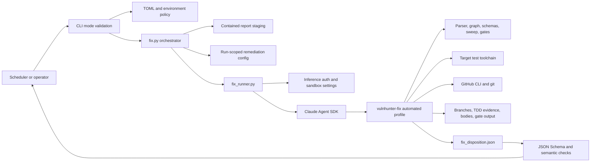
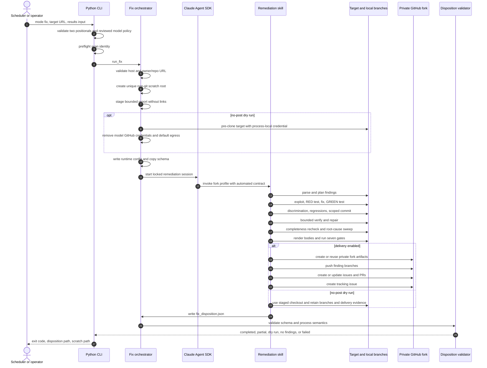
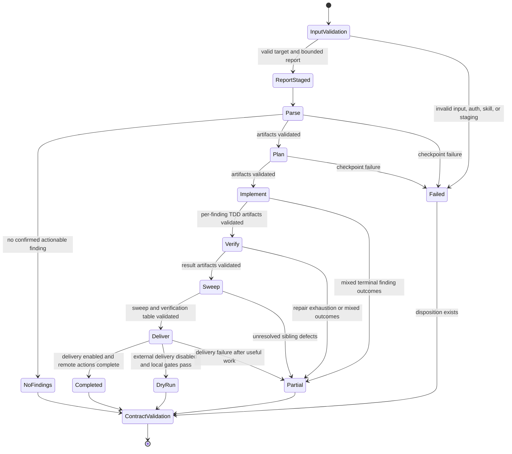

# Automated fix-mode architecture

Status: implemented, source-derived

Analyzed snapshot: 2026-08-02

This document describes how `vulnhunter-agent --mode=fix` turns the interactive
`vulnhunter-fix` methodology into a bounded unattended workflow. It supplements the
[architecture overview](README.md), [runtime views](runtime-views.md), and
[quality/risk assessment](quality-and-risks.md).

## 1. Scope and architectural intent

The implementation automates the remediation skill's **fork workflow**. It does not
automate the in-place workflow, because in-place execution is designed for live policy
decisions, modifies a developer-owned checkout, and uses an uncapped collaboration
loop. Fix mode instead starts outside every Git checkout, supplies an explicit target
and staged report, and requires delivery to remain in a private fork.

“Automated” changes checkpoint control, not remediation rigor:

- Interactive execution validates artifacts, summarizes the phase, and waits for an
  operator Approve/Pause choice.
- Agent execution validates the same artifacts, records a machine checkpoint, and
  advances only when validation succeeds.
- Neither execution profile may bypass exploit proof, RED→GREEN tests, discrimination
  evidence, regression policy, caller analysis, completeness classification, root-cause
  sweep, schemas, or delivery gates.

This distinction is encoded in the skill through `VULNFIX_AUTOMATED=1`, not improvised
by asking the model to ignore its interactive instructions.

## 2. Functional equivalence map

| Remediation capability | Interactive `vulnhunter-fix` | Agent fix profile |
|---|---|---|
| Finding source | Labeled issues or local report | Explicit local report or single-report GitHub repository |
| Git mode | In-place worktrees or fork | Fork only; isolated non-git run root forces canonical dispatch |
| Planning | Operator checkpoint | Validated recorded checkpoint |
| TDD | Exploit, transient RED scaffold, fix, GREEN, exploit blocked | Same |
| Test persistence | Promote scaffold into repository convention | Same; Gate 7 rejects committed scaffolds |
| Repair | Uncapped with developer | Bounded by `max_repair_attempts`, then human-review outcome |
| Breaking/external decision | Interactive collaboration | `BREAKING_CHANGE` or `CANNOT_AUTO_FIX`; no guessing |
| Completeness | FULL, MITIGATION, or WORKAROUND with honesty guards | Same |
| Caller evidence | AST graph, explicit grep fallback | Same |
| Root-cause sweep | Required | Required |
| Delivery validation | Seven fail-closed gates | Same |
| GitHub destination | Source repo or private fork | Private fork only |
| Local dry run | Not a separate profile | `--no-post`: Python pre-clone, then all local evidence/gates with no model GitHub credential or default GitHub egress |
| Final process contract | Human summary and phase artifacts | Human summary plus validated `fix_disposition.json` v1 |

## 3. Component view



### Component responsibilities

| Component | Responsibility | Explicitly does not own |
|---|---|---|
| CLI | Mode arity, cross-mode flag rejection, explicit reviewed-model enforcement, Mythos no-post policy, standalone token preflight | Finding interpretation or patch generation |
| `fix.py` | URL validation, scratch containment, report staging, runtime policy, outcome mapping | GitHub remediation commands or TDD decisions |
| `fix_runner.py` | Locked SDK tools, credentials, sandbox extensions, kickoff contract, event log, schema classification | Phase semantics or result synthesis |
| Skill automated profile | Complete parse/plan/implement/verify/sweep/deliver methodology and terminal finding triage | Choosing interactive-only policy decisions |
| Helper scripts/library | Deterministic parsing, graph evidence, schemas, branch masking, render guards, seven gates | Process orchestration |
| Disposition validator | Shape plus cross-field process invariants | Proving that cited source evidence is truthful |

## 4. Runtime sequence



## 5. Phase state and exit criteria



For `COMPLETED` and `DRY_RUN`, the agent requires exactly one validated checkpoint for
each of `parse`, `plan`, `implement`, `verify`, `sweep`, and `deliver`. A successful
finding whose status begins with `VERIFIED` must also report `gate_status=PASS`.

## 6. Run directory and artifact contracts

Every invocation creates:

```text
<fix.scratch_base_dir>/
  <repo>-<UTC timestamp>-<random suffix>/
    report/                         staged immutable report copy
    results-source/                 remote report clone, when used
    vulnfix-runtime-config.json     trusted per-run policy
    fix_disposition.schema.json     schema copy visible to the session
    agent.log                       append-only terse SDK event log
    .tmp/                           cwd-contained exploit/temp files
    work/                           skill clone, branches, manifests, evidence
    out/
      fix_disposition.json          final agent contract
```

The runtime config carries only policy, not credentials. It fixes the following
invariants:

- automated execution is true;
- delivery is enabled or disabled by the CLI;
- target GitHub host and default branch;
- fork organization/prefix and labels;
- private visibility and fork-only delivery;
- bounded repair attempts and test timeout;
- regression test policy;
- optional collaborators;
- worktree retention.

For `--no-post`, `behavior.target_checkout` identifies the Python-staged target clone.
For delivery-enabled runs it is null and the skill performs its normal private-fork
setup.

The disposition schema records run status, target/report identity, delivery policy,
phase checkpoints, per-finding terminal status, completeness tier, branch/commit,
delivery URLs, gate status, residual vectors, and a summary. The Python layer adds
semantic checks that are awkward or brittle in JSON Schema: exact requested identity,
unique finding/checkpoint keys, complete success phases, dry-run consistency, and gate
success for verified findings.

## 7. Detailed TDD and verification chain

For each finding, the automated profile retains the source skill's evidence order:

1. Confirm the vulnerable pattern still exists on the base branch.
2. Build an attacker-capability exploit demonstration in the run-local temporary path.
3. Decide whether the fix is independently patchable.
4. Create a transient security-test scaffold against the production function.
5. Run it before editing source and persist failing RED evidence plus the test hash.
6. Implement the conservative root-cause fix; reject placeholders and undefined values.
7. Check public-interface and cross-repository effects. External coordination becomes a
   terminal human-required outcome.
8. Run the security test GREEN and replay the exploit to show it is blocked.
9. Stash the fix and rerun the test to prove it discriminates vulnerable from fixed
   behavior; persist `pre_fix_result=fail` and `post_fix_result=pass`.
10. Apply the configured regression policy and classify environment errors separately
    from real regressions.
11. Check file scope and update only pre-existing tests that encoded vulnerable behavior.
12. Promote the transient scaffold into the repository's discoverable test convention.
13. Commit one scoped finding change on a masked branch.
14. Independently review test quality, perform bounded diagnose/repair attempts, and
    record each attempt.
15. Reclassify actual completeness, enumerate routed and unrouted callers, sweep sibling
    instances, and revise over-strong tiers.
16. Render the nine-column verification table and delivery bodies.
17. Run all seven gates before any delivery mutation.

## 8. Terminal finding outcomes

| Status | Meaning | Delivery behavior |
|---|---|---|
| `VERIFIED*` | Security test and verification passed with disclosed completeness | Ready or draft PR according to setup/review needs |
| `ALREADY_FIXED` | Base branch no longer contains the report defect | No fix PR; record evidence |
| `CANNOT_AUTO_FIX` | Missing external value or non-independent coordination | Issue only in delivery mode |
| `BREAKING_CHANGE` | External callers or contract migration require coordination | Issue only with structured caller actions |
| `NEEDS_MANUAL_REVIEW` | Bounded repair exhausted or validation remains ambiguous | Draft PR and human-review details when a useful branch exists |
| `REQUIRES_HUMAN_DECISION` | Several policy-valid choices cannot be selected safely | Human-required artifact, no guessed patch |
| `FAILED` | Finding execution failed before a safer terminal classification | Preserve evidence and fail/partial run |
| `DELIVERY_FAILED` | Local remediation succeeded but remote delivery did not | Preserve branch/bodies/gates and return partial/failure |

## 9. Process exit codes

| Code | Fix-mode meaning |
|---:|---|
| 0 | `COMPLETED`, `DRY_RUN`, or `NO_FINDINGS` disposition passed all validation |
| 1 | Staging, SDK, missing output, schema, semantic, or terminal run failure |
| 2 | Invalid target/results argument shape |
| 3 | Required GitHub scan identity missing |
| 5 | Valid `PARTIAL` disposition; useful work exists but the run is not complete |
| 64 | Top-level CLI/config usage error, including a model outside Opus 4.7, Opus 4.8, and Mythos 5 |
| 130 | Caller interruption |

## 10. Security and trust boundaries

Fix mode intentionally has more authority than scan or static verify mode. Its model
can execute target tests and operate git/GitHub because those capabilities are necessary
to produce evidence-backed fixes. Controls therefore emphasize containment and least
privilege:

- URL credentials, query strings, fragments, cross-host targets, and deep repository
  paths are rejected before the session.
- Local reports are copied; remote report repositories use the reports identity and
  must resolve unambiguously. Links and special files are rejected and size/count limits
  cap resource use.
- GitHub's scan token is passed only in the Claude process environment. A process-local
  Git credential helper expands the token at request time, so it is absent from argv,
  files, and clone remotes.
- Sandbox egress always includes inference. Delivery-enabled sessions add the configured
  GitHub endpoints. Extra package mirrors are explicit `[fix].allowed_domains`; target
  content cannot expand the list.
- Fix mode forces the command sandbox on, fails if it is unavailable, and disables
  unsandboxed-command fallback even when the general agent sandbox policy is looser.
- Temporary exploit files are redirected beneath the run root.
- The private-fork-only and no-upstream rules exist in both the skill profile and the
  run-scoped configuration.
- `--no-post` is a technical side-effect boundary, not merely a prompt instruction:
  Python stages the target first, then the strictly sandboxed model receives blank
  GitHub token variables, a disabled Git credential helper, and no default GitHub
  sandbox domains.

Mythos 5 is accepted only on this no-post path and only after the shared hardened
runtime, retention, strict-sandbox, telemetry-off, and inference-only proxy checks.
Delivery-enabled automated remediation remains an Opus profile.

Residual risk remains: a model with Bash and a GitHub token can technically read its
environment, and repository tests execute untrusted code. Deploy fix mode in an
ephemeral container or VM, use a token restricted to the intended target/fork scope,
limit network egress, disable content telemetry unless approved, and do not mount
unrelated secrets or host paths.

## 11. Configuration reference

| Setting | Default | Effect |
|---|---:|---|
| `fix.scratch_base_dir` | `./fix_runs` | Parent of unique forensic run directories |
| `fix.clone_timeout_seconds` | `300` | Remote results clone bound |
| `fix.skill_dir` | blank | Explicit installed skill path; otherwise standard search |
| `fix.fork_org` | blank | Private fork owner; blank means authenticated user |
| `fix.fork_prefix` | `vulnhunter-fix` | Private fork name prefix |
| `fix.default_base_branch` | `main` | Delivery and full-branch gate base |
| `fix.pr_draft` | `true` | Default for draft-required triage |
| `fix.pr_labels` | security labels | Labels for generated fork artifacts |
| `fix.collaborators` | empty | `username:admin`, `username:write`, or `username:read` entries |
| `fix.max_repair_attempts` | `3` | Fork-mode bounded repair limit |
| `fix.test_timeout_seconds` | `120` | Per-test command budget supplied to the skill |
| `fix.test_policy` | `best-effort` | Regression handling: best-effort, must-pass, or skip |
| `fix.allowed_domains` | empty | Additional sandbox egress for package/toolchain mirrors |
| `fix.keep_workdir` | `true` | Preserve local remediation clone/evidence after delivery |
| `fix.max_report_files` | `10000` | Staged-report file-count limit |
| `fix.max_report_bytes` | `500000000` | Staged-report byte limit |

All scalar/list settings also follow the agent's `VULNHUNT_FIX_<KEY>` environment
overlay convention. CLI `--scratch-dir`, `--test-policy`, `--model`, and `--no-post`
override the corresponding run behavior.

## 12. Source map

| Concern | Source |
|---|---|
| CLI and mode validation | [`agent/__main__.py`](../../vulnhunter-agent/agent/__main__.py) |
| Fix policy loading | [`agent/config.py`](../../vulnhunter-agent/agent/config.py) |
| Containment, staging, semantic validation | [`agent/fix.py`](../../vulnhunter-agent/agent/fix.py) |
| SDK tools, credentials, kickoff, schema validation | [`agent/fix_runner.py`](../../vulnhunter-agent/agent/fix_runner.py) |
| Final contract | [`fix_disposition.schema.json`](../../vulnhunter-agent/agent/schemas/fix_disposition.schema.json) |
| Automated skill profile | [`vulnhunter-fix/SKILL.md`](../../vulnhunter-fix/SKILL.md) |
| TDD implementation | [`implement.md`](../../vulnhunter-fix/prompts/implement.md) |
| Verification and repair | [`verify.md`](../../vulnhunter-fix/prompts/verify.md) |
| Delivery and gates | [`deliver.md`](../../vulnhunter-fix/prompts/deliver.md), [`run-gates.py`](../../vulnhunter-fix/scripts/run-gates.py) |
