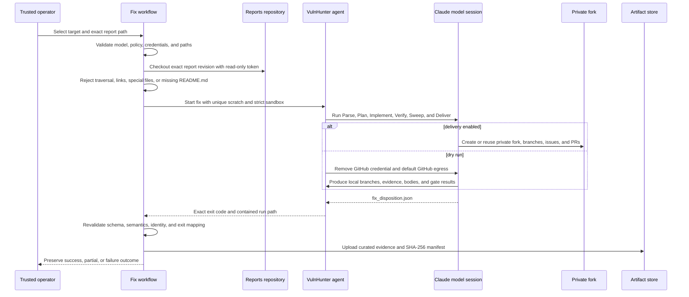
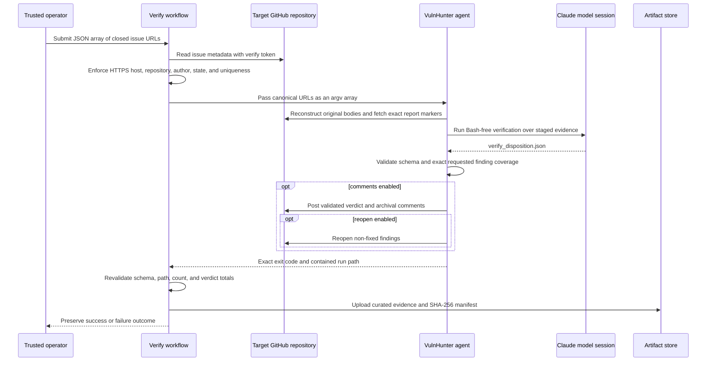

# GitHub Actions remediation and verification

## Purpose and scope

The repository provides two independently callable workflows:

- `.github/workflows/vulnhunter-agent-fix.yaml` runs the automated
  `/vulnhunter-fix` fork workflow against one exact published scan report.
- `.github/workflows/vulnhunter-agent-verify.yaml` runs
  `/vulnhunt-fix-verify` against a homogeneous batch of closed finding issues.

Both workflows support `workflow_dispatch` and `workflow_call`. Neither has a schedule,
`pull_request`, `pull_request_target`, or automatic `workflow_run` trigger. Remediation
and issue mutation therefore require an explicit trusted invocation. The jobs use
read-only built-in `GITHUB_TOKEN` permissions; cross-repository access is supplied through
separate, purpose-specific secrets.

`workflow_call` is intentionally restricted to callers in this repository. Both jobs
check out `github.repository` and then execute repository-local composite actions through
`./.github/actions/...`; a cross-repository caller would otherwise make those paths resolve
against the caller's workspace rather than this reviewed implementation. The first job
step rejects a workflow reference owned by a different repository before checkout. An
organization-wide reusable interface would require the workflow implementation and every
composite action to be referenced from a reviewed immutable external ref instead.

For allowed invocations, checkout is pinned to `github.workflow_sha`, not the caller's
`github.sha`. The repository-local composites therefore come from the same immutable
revision as the workflow definition even when a same-repository caller uses another ref.

This release supports the reviewed Opus 4.7, Opus 4.8, and Mythos 5 execution
profiles. Selecting Mythos routes the model turn — and, for fix, target-repo access
too — through a gVisor-isolated container that never receives a GitHub credential;
see [Mythos gVisor execution](#mythos-gvisor-execution) below and the
[Mythos security profile](mythos-security-profile.md) for the full control and
failure matrix. Fix and verify each split into a trusted stage (GitHub reads/clones,
report staging) and a credential-free evaluate step for Mythos specifically — Opus
still runs as the single monolithic Python operation described in the rest of this
document.

## Workflow decomposition

| Composite action | Trust role | Credentials |
|---|---|---|
| `setup-vulnhunter-agent` | Resolve trusted paths, install reviewed skills, create run-scoped Python environment | None |
| `prepare-vulnhunter-fix` | Validate fix policy, checkout an exact reports revision, attest one link-free report, create empty scratch | Reports token only |
| `run-vulnhunter-fix` | Execute the code-running remediation skill and preserve its exact exit code/output paths | AWS workspace credentials and fix token |
| `attest-vulnhunter-fix` | Re-run schema and semantic validation; reconcile exit status with disposition status | None |
| `prepare-vulnhunter-verify` | Parse issue JSON, enforce host/repository homogeneity, closed state, and trusted original author | Verify token |
| `run-vulnhunter-verify` | Fetch evidence, clone inputs, run the Bash-free verify skill, and optionally comment/reopen | AWS workspace credentials, verify token, reports token |
| `attest-vulnhunter-verify` | Revalidate aggregate schema, path containment, entry count, and safe verdict counts | None |
| `package-vulnhunter-run` | Copy curated regular-file evidence and create a SHA-256 manifest | None |

Large shell bodies remain in composites so the entrypoint-to-environment mapping is
reviewable alongside workflow inputs. The Python agent remains the source of truth for
security methodology, report copying, disposition schema validation, semantic gates,
issue reconstruction, and GitHub mutation behavior.

### GitHub origin propagation

The workflow-owned `github.server_url` is the sole GitHub web origin. Each prepare action
receives it as `github-server-url`, validates an exact HTTPS origin, and emits
`github-host` as the normalized `hostname[:port]` authority. Fix preparation also derives
the canonical target URL from that origin; verify preparation requires every issue URL to
match the same scheme, hostname, and port and preserves that authority in canonical issue
URLs and GitHub CLI calls.

The workflow passes the prepared `github-host` output to the corresponding run action.
The run action exports it as `VULNHUNT_GITHUB_HOST`, overriding the `github.com` example
configuration before the Python agent validates clone, REST, GraphQL, report, issue, and
fork destinations. The reports-repository URL is constructed from the same
`github.server_url`. No remediation step may infer `github.com` or discard a configured
GitHub Enterprise Server port.

## Fix runtime

Fix mode intentionally exposes Bash and can execute repository tests. Delivery-enabled
runs also expose a powerful short-lived GitHub identity to the model process. Use the
`vulnhunter-fix` environment with required reviewers and a disposable runner. Configure
`VULNHUNT_FIX_RUNNER` to a dedicated ephemeral runner label when available. Do not use a
persistent general-purpose self-hosted runner or attach unrelated secrets and mounts.

The selected report is addressed by `reports_repository`, `reports_ref`, and
`results_path`. Passing the multi-report central repository URL directly is intentionally
avoided because fix-mode remote staging rejects repositories containing multiple reports.
The workflow sparse-checks out and passes exactly one local report directory.

`delivery_enabled` defaults to false. A dry run still needs the fix token in the trusted
Python controller to clone a private target, but the controller pre-stages that checkout,
then the model environment blanks GitHub credentials and removes default GitHub egress.
When delivery is enabled, every remote artifact must remain in a private fork; upstream
repository mutation is outside the fix contract.

## Verify runtime

`issue_urls_json` is a JSON array rather than a shell-delimited string. The workflow also
requires `expected_repository`, which both constrains intake and supplies a stable
repository-scoped concurrency key. Intake accepts at most 100 unique issue URLs, requires
the configured HTTPS GitHub host, and rejects mixed repositories. Every issue must already
be closed and its stable GitHub author login must appear in the protected repository or
organization variable `VULNHUNT_TRUSTED_ISSUE_AUTHORS`. This author gate is important
because the original
issue body contains the report identity markers and those markers are not cryptographically
bound to a scan.

`post_comments` and `reopen_nonfixed` default to false. Reopening requires comments to be
enabled. The model session never receives Bash, but verify still uses a trusted GitHub
identity in the surrounding process for evidence intake and optional delivery. A future
Mythos design must split this into trusted stage, credential-free gVisor evaluate, and
trusted deliver phases.

## Mythos gVisor execution

Selecting `model: claude-mythos-5` changes three things in both workflows: the job
runs on a `gvisor`-labeled runner instead of `ubuntu-latest`, a credential-free
isolation-proof canary (`scripts/validate_mythos_isolation.sh`, unchanged from scan)
runs before the mutable stage, and the actual model turn moves inside a gVisor
container built from the same `Dockerfile.mythos` and `mythos-egress` Squid proxy
scan already uses. `delivery_enabled` / `post_comments` must be `false` when Mythos
is selected — enforced redundantly at the workflow's prepare-action gate and, again,
independently, by `agent.model_policy.enforce_mythos_mode_policy` inside the Python
agent — so a Mythos run can only ever produce local evidence, never a fork/PR/issue
or a posted/reopened comment.

Fix and verify reach that container differently, because only fix's GitHub use
(cloning the target) is a single step that can be pre-staged and handed off wholesale:

- **Fix** (`scripts/run_mythos_fix_sandbox.sh`) clones the target on the trusted
  runner with the fix token — the same way the non-Mythos path's dry run always
  has — then builds and launches the container, streams in that checkout and the
  already-staged report (no re-clone, no token), and runs the *entire*
  `python -m agent --mode=fix --target-checkout ...` invocation inside via
  `docker exec`. `--target-checkout` is new: it tells `agent.fix.run_fix` to use a
  pre-staged checkout directly and skip `get_github_token`/`shallow_clone` entirely,
  so the container process never needs — and is never given — a GitHub credential.
  Delivery is impossible either way (`--no-post` is mandatory under Mythos), so
  there is no separate deliver phase to design around.
- **Verify** (`scripts/run_mythos_verify_sandbox.sh`) cannot use the same shape:
  verify's GitHub token drives both the issue/comment/timeline REST+GraphQL fetch
  *and* the target-repo clone, not just one clone. `python -m agent --mode=verify`
  therefore keeps running as an ordinary trusted-host process for every model,
  including Mythos — fetch, clone, homogeneity, and the Haiku cross-repo pre-flight
  are unaffected. Only the point where that process would start an in-process SDK
  session (`verify._run_skill`) is swapped: for Mythos, `agent.verify_mythos.
  run_skill_mythos` renders the same kickoff prompt and `comments.md` from
  already-fetched, already-credential-free data, then calls the sandbox script to
  stream those inputs into a container and run the turn there via
  `agent._mythos_verify_entry`, a small dedicated entrypoint that calls the same
  `verify_runner.run_verify_session` every other model uses. The disposition streams
  back out to the exact path the in-process path would have produced it at, so
  everything downstream (`_verify_entry_count`, audit emission, `_post_dispositions`,
  `attest-vulnhunter-verify`) is unchanged and model-agnostic. Because verify's
  trusted-host process is not itself the hardened runtime, it calls
  `enforce_mythos_mode_policy(..., check_runtime_environment=False)` — the full
  base-policy check (hardened-runtime marker, pinned proxy, sandbox posture) instead
  runs once, independently, inside `agent._mythos_verify_entry`.

Both sandbox scripts reuse `scripts/_mythos_docker.sh`'s trusted Docker access helper
and reproduce the same mechanical isolation assertions as
`scripts/run_mythos_sandbox.sh` (runsc runtime, read-only root, dropped capabilities,
no host mounts/devices/socket, and a grep over the container's declared environment
variable *names* — not values — that fails the run if any GitHub credential variable,
fix or verify, is present) before ever invoking the model. See
[Mythos security profile](mythos-security-profile.md) for the full layered-control
table and residual risks, including the fact that Mythos fix mode can never install a
new dependency (`fix.allowed_domains` is forbidden under Mythos), so it only suits
findings whose fix doesn't need one.

## Secrets and minimum roles

| Secret | Used by | Minimum purpose |
|---|---|---|
| `ANTHROPIC_AWS_WORKSPACE_ID` | Fix and verify model sessions | Claude Platform workspace selection |
| `ANTHROPIC_AWS_API_KEY` | Fix and verify model sessions | Claude Platform authentication |
| `VULNHUNT_GITHUB_REPORTS_TOKEN` | Exact report checkout or named report download | Read-only central reports contents |
| `VULNHUNT_GITHUB_FIX_TOKEN` | Fix trusted clone and optional model delivery | Private target read; private-fork administration, contents, issues, and PR write only when delivery is approved |
| `VULNHUNT_GITHUB_VERIFY_TOKEN` | Verify intake, evidence fetch, clone, and optional issue mutation | Target contents/metadata/issues read; issues write only when comments or reopen are enabled |

Prefer short-lived GitHub App installation tokens. Do not put tokens in workflow inputs,
generated TOML, command arguments, job outputs, summaries, or artifacts. Every checkout
sets `persist-credentials: false`. Secrets enter composite shell through `env` and are
masked before further validation.

## Outcomes and artifacts

The run composites capture outputs before returning the agent's real exit code. Workflows
temporarily use `continue-on-error` so credential-free attestation and artifact packaging
can still run, then a final step restores failure if setup, intake, execution, attestation,
packaging, or upload did not succeed. Partial fix status remains a failed workflow.

Artifacts are security-sensitive. They may contain exploit evidence, patches, model logs,
comments, and internal identifiers. Packaging excludes `.git`, target/report clones,
dependency caches, temporary directories, virtual environments, and special files. It
rejects symlinks and writes `SHA256_MANIFEST.json` for every copied file. Retention defaults
to 14 days and should be reduced where organizational evidence policy permits.

## Operations

### Fix dry run

1. Publish or retain a completed scan report.
2. Dispatch `VulnHunter Agent Fix` with the exact reports repository/ref/path.
3. Leave `delivery_enabled=false`.
4. Review the disposition, workflow attestation, gate evidence, and artifact manifest.
5. Store fork organization and allowed dependency domains in protected
   `VULNHUNT_FIX_FORK_ORG` and `VULNHUNT_FIX_ALLOWED_DOMAINS` variables, then approve a
   separate delivery-enabled invocation only after reviewing those policy values.

### Verify dry run

1. Supply a JSON array such as `["https://github.com/org/repo/issues/123"]`.
2. Configure `VULNHUNT_TRUSTED_ISSUE_AUTHORS` with the scanner bot or App login that
   created the finding.
3. Leave both mutation toggles false.
4. Review verdict totals and curated evidence before enabling comments or reopen behavior.

### Mythos dry run (fix or verify)

1. Provision a `gvisor`-labeled runner per
   [Mythos security profile § GitHub Actions and scale](mythos-security-profile.md#github-actions-and-scale)
   — Docker with the `runsc` runtime registered, ephemeral/single-job, no persistent
   workspace.
2. Select `model: claude-mythos-5` on dispatch and set `mythos_retention_acknowledged:
   true` — both are required or the prepare step rejects the run before any clone.
3. Leave `delivery_enabled` / `post_comments` at their `false` default; Mythos rejects
   any other value.
4. Review the `Mythos gVisor isolation proof` step summary before trusting the run's
   evidence — it must show every `ISOLATION_PROOF` line, matching scan's.
5. For fix, remember the container has no route beyond the Claude Platform endpoint:
   findings whose fix needs a new dependency will not succeed under Mythos regardless
   of `fix.allowed_domains` (which is forbidden here anyway). Retry those under Opus.

### Failure recovery

- Intake failures occur before model execution and should be corrected rather than retried.
- Authentication and sandbox failures require credential or runner repair.
- Missing or schema-invalid dispositions are infrastructure failures; do not synthesize a
  disposition or interpret partial model prose as success.
- A fix `PARTIAL` disposition must remain non-successful even if some PRs were created.
- Verify posting failures may happen after a valid disposition; use the artifact and issue
  mutation record to reconcile before rerunning.
- Concurrency is serialized per fix target and per explicit verify repository scope, with
  `cancel-in-progress: false`, to prevent overlapping fork or issue mutations.

## Residual risks

- Delivery-enabled fix under Opus still places a GitHub credential and Bash in the
  model process — Mythos fix mode does not have this exposure (delivery is
  impossible under Mythos, and `--target-checkout` means the container it runs in
  never receives a credential at all), but it is still true whenever Opus is
  selected with `delivery_enabled=true`.
- Fix disposition facts are schema/semantics validated but are not yet independently
  reconciled against every remote branch, commit, issue, PR, label, and gate artifact.
- Verify evidence roots under Opus are logically untrusted but not mounted
  mechanically read-only inside a separate container — the trusted host process
  reads them directly. Mythos verify closes this specific gap for the model turn
  itself (see [Mythos gVisor execution](#mythos-gvisor-execution)), but the
  fetch/clone/homogeneity/pre-flight code that produces those inputs is identical,
  and identically un-containerized, for both models.
- Trusted issue authorship is an organizational provenance control, not a cryptographic
  signature over report markers.
- Third-party actions are version-tag pinned rather than commit-SHA pinned; production
  deployments should pin reviewed immutable SHAs through dependency policy.
- The Mythos fix/verify sandbox scripts are new in this change and have not yet been
  exercised against a live `gvisor`-labeled runner in this repository; the mechanical
  isolation assertions they share with the proven scan launcher (runsc pinning,
  read-only root, capability drop, no-credential-in-container grep) are exercised by
  the isolation-proof canary step, but the fix/verify-specific `docker exec` payloads
  themselves are covered by unit and static-contract tests, not an end-to-end run.
