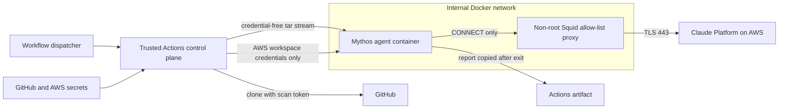

# Mythos 5 security and deployment profile

This profile adds `claude-mythos-5` without treating it as a drop-in rename of an
Opus model. Mythos 5 has the same model capabilities as Fable 5 but does not apply
safety classifiers. It is limited-access, always uses adaptive thinking, has a
1-million-token context window, and its requests have mandatory 30-day retention;
zero-data-retention is unavailable. Those provider properties make containment,
data classification, and explicit retention acceptance part of model selection.

Primary provider references:

- [Introducing Claude Fable 5 and Claude Mythos 5](https://platform.claude.com/docs/en/about-claude/models/introducing-claude-fable-5-and-claude-mythos-5)
- [Claude model overview](https://platform.claude.com/docs/en/about-claude/models/overview)
- [API data retention](https://platform.claude.com/docs/en/manage-claude/api-and-data-retention)
- [Claude Platform on AWS model IDs](https://docs.aws.amazon.com/claude-platform/latest/userguide/models.html)

## Scope

The scalable GitHub Actions profile supports read-only scan mode. It deliberately
does not put report publishing or issue creation inside the Mythos container.
Application policy also recognizes Mythos for fix and verify, but requires
`--no-post` (and `--no-reopen` for verify), forbids extra model egress, and expects
inputs to be staged by a separate control plane.

The exact Claude Platform on AWS model ID is `claude-mythos-5`. The exact regional
endpoint is:

```text
aws-external-anthropic.us-east-1.api.aws:443
```

The `us.east-1` spelling is invalid. This integration is Claude Platform on AWS,
not Amazon Bedrock; the Bedrock model/endpoint identifiers are therefore not used.

## Trust boundaries and flow



The control plane is trusted and short-lived. It owns cloning, image building, and
artifact extraction. The model container is untrusted: it has no host bind mount,
Docker socket, GitHub token, report token, cloud metadata route, or general Internet
route. The checkout and all model state live on run-scoped tmpfs.

## Layered controls

| Layer | Enforced control |
|---|---|
| Model policy | Exact model comparison; no substring aliases; approved remediation set is Opus 4.7, Opus 4.8, and Mythos 5 |
| Data governance | `mythos.data_retention_acknowledged=true` is mandatory and fails before clone/model startup |
| Provider route | `anthropic_aws`, `us-east-1`, workspace ID, and workspace API key are mandatory |
| Process policy | Telemetry off; SDK sandbox forced on; fail if unavailable; unsandboxed fallback forbidden |
| Tool policy | Scan is read-only; Bash cannot be enabled; model sees only the configured Read/Write/Glob/Agent envelope |
| Settings isolation | Mythos loads only the installed user skill; target-controlled project/local Claude settings and hooks are not loaded |
| Credential isolation | GitHub scan token is used only by the control plane; report token is not provided to the Mythos action path; AWS secrets use a mode-0600 Docker env file rather than argv |
| Container boundary | `runsc`, non-root UID/GID 65532, read-only root, all Linux capabilities dropped, `no-new-privileges`, no devices/mounts/socket, private IPC, PID/file/memory/CPU limits |
| Mutable storage | `/workspace`, `/tmp`, and `~/.claude` are size-bounded tmpfs with `nodev`, `nosuid`, and `noexec` |
| Network boundary | Agent attaches only to an `--internal` user-defined Docker network; the proxy is dual-homed on that network and a separate run-scoped user-defined egress bridge; direct agent socket egress is tested and must fail |
| Proxy boundary | Non-root, read-only Squid sidecar accepts CONNECT only to the exact AWS hostname on port 443; all other methods, ports, and destinations are denied |
| Proxy discovery | Both proxy networks are attached before `runsc` starts, and the trusted launcher injects the attested internal proxy IP into the agent hosts file; the agent does not depend on external or Docker embedded DNS to find its only egress gateway |
| Startup attestation | Launcher checks the runtime exists, then verifies Docker reports `Runtime=runsc`, the intended network, and a read-only root before setting `VULNHUNT_MYTHOS_HARDENED_RUNTIME=1` |
| Auditable preflight | The composite action first launches a credential-free disposable canary under the same gVisor, filesystem, capability, namespace, and egress constraints; it prints sanitized `ISOLATION_PROOF` records and fails unless direct HTTP/HTTPS and proxied `example.com` access are denied |
| Egress canaries | Before inference, direct `1.1.1.1:443` must fail, `CONNECT example.com:443` must return 403, and the exact AWS CONNECT must return 200 |
| Output boundary | Model output is copied out only after execution; publishing and issue mutation are separate, explicitly authorized operations |

These are defense-in-depth layers. gVisor reduces exposure to the host kernel, but
it is not a proof that escape is impossible. The Docker daemon and runner control
plane remain privileged assets and must not be reachable from the model container.

## GitHub Actions and scale

The `org-ai-security-discovery.yaml` workflow offers three model choices. Opus runs
on `ubuntu-latest`; Mythos targets a runner label/ARC scale-set name of `gvisor`.
The composite action then selects the hardened launcher automatically.

Provision the `gvisor` scale set as ephemeral Linux runners with:

1. Docker Engine and the `runsc` runtime installed and registered.
2. The runner service account in the group owning `/var/run/docker.sock` before
   the runner service starts. The launcher can fall back to non-interactive
   `sudo -n docker` without changing socket permissions, but direct access is
   preferred. Docker control-plane access is root-equivalent, so use only
   ephemeral, single-job runners and never expose the socket to the model
   container.
3. No persistent repository workspace between jobs.
4. No workload identity or instance metadata available to job containers unless
   independently firewalled.
5. Enough local disk to build the two runtime images and enough memory for the
   configured 8 GiB agent cap.
6. Runner-group access restricted to this workflow/repository.

GitHub-hosted runners are not used for Mythos because this repository cannot attest
that their Docker daemon exposes gVisor. The launcher never falls back to `runc`.
For horizontal scaling, use an Actions Runner Controller runner scale set named
`gvisor`; see [Deploying runner scale sets](https://docs.github.com/en/actions/how-tos/manage-runners/use-actions-runner-controller/deploy-runner-scale-sets).

## Operator configuration

Select Mythos through workflow dispatch and check the retention acknowledgement.
The action passes the model dynamically; no committed secret-bearing TOML is needed.
For a direct, already-isolated invocation the equivalent config is:

```toml
[anthropic]
auth_mode = "anthropic_aws"
model = "claude-mythos-5"
aws_region = "us-east-1"

[sandbox]
enabled = true
fail_if_unavailable = true
allow_unsandboxed_commands = false

[mythos]
data_retention_acknowledged = true
https_proxy = "http://mythos-egress:3128"

[telemetry]
enabled = false
```

Workspace ID/API key and the runtime marker must remain environment-provided. Do not
commit them. The supported GitHub path is `scripts/run_mythos_sandbox.sh`, which sets
the marker only after its outer Docker inspection checks pass.

## Fail-closed behavior

The run stops before inference when any of these are true:

- Mythos access has not been enabled for the workspace.
- Retention is not acknowledged.
- Auth is not Claude Platform on AWS in `us-east-1`.
- gVisor is absent or Docker reports a different runtime.
- SDK sandboxing is disabled, optional, or allows unsandboxed fallback.
- Telemetry, Bash, publish/issues, a GitHub token, or an extra domain reaches the
  Mythos model settings.
- The agent gets direct egress or the proxy accepts a denied destination.

## Residual risks and operational limits

- Mythos is limited availability; workspace entitlement must be obtained through
  Anthropic/AWS before a live test can succeed.
- Source and prompts sent for inference are retained for 30 days by provider policy.
  Do not scan repositories whose classification forbids that retention.
- The proxy enforces the requested hostname/port. AWS may change DNS answers; the
  design intentionally avoids brittle IP pinning. TLS certificate validation remains
  active in Claude Code.
- Image builds need general network access in the trusted control plane. Production
  deployments should build, scan, sign, and pin these images in advance, then allow
  the runtime job to pull only from a trusted private registry.
- The current Dockerfiles use versioned tags rather than digest-pinned base images.
  A release pipeline should resolve approved digests and pass them through the build
  arguments.
- The outer GitHub runner can access supplied secrets by design. Use ephemeral
  runners, protected environments, scoped secrets, and separate AWS workspaces/API
  keys for Mythos workloads.
