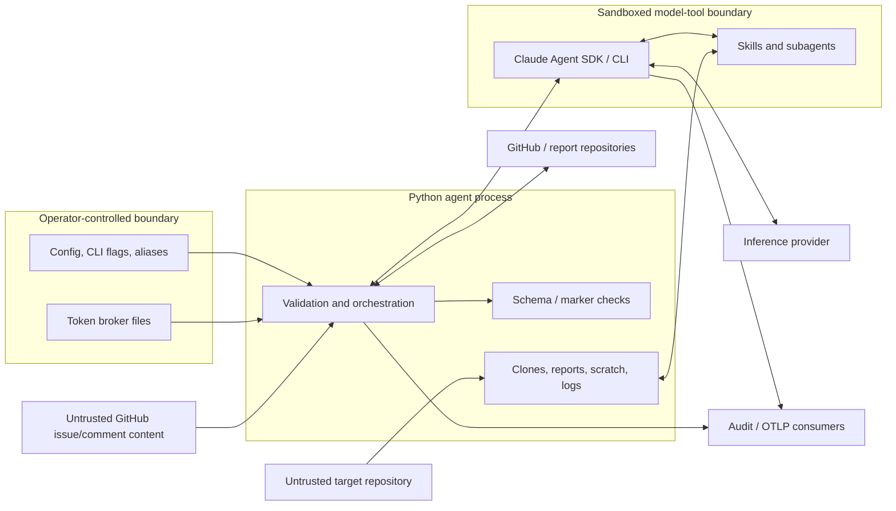

# Quality attributes, threats, and risks

This assessment uses ISO/IEC 25010 quality categories for scenarios and STRIDE for
trust-boundary review. It is an architecture assessment, not a penetration test or a
claim that every listed control has been independently security-verified.

## 1. Quality priorities

| Priority | Attribute | Why it matters here |
|---:|---|---|
| 1 | Security | The system intentionally processes hostile source and publishes security-sensitive evidence using privileged identities |
| 2 | Reliability | A run can be long and expensive, with multiple remote services and partial-success states |
| 3 | Functional suitability | False positives, missed callers, or unverifiable fixes undermine the product's purpose |
| 4 | Maintainability | Prompts, Python, schemas, templates, and helper scripts must evolve without contract drift |
| 5 | Auditability | Operators must reconstruct what code, report, model, evidence, and identity produced an outcome |
| 6 | Performance efficiency | Parallel analysis and bounded context usage matter, but correctness takes precedence over throughput |
| 7 | Portability | The agent targets containers/workstations, while remediation depends on POSIX shell and local developer tooling |

## 2. Quality scenarios (ISO/IEC 25010)

These scenarios turn qualities into verifiable architecture requirements. “Current
mechanism” describes implemented evidence; “recommended measure” is suitable for CI or
an operational SLO.

| ID | Attribute | Stimulus and expected response | Current mechanism | Recommended measure |
|---|---|---|---|---|
| QA-SEC-01 | Confidentiality / integrity | A malicious target repository is scanned without operator code-execution consent; no target command runs | Read-only prompt, Bash stripped, strict tool visibility, optional sandbox | Contract test proving every default CLI/config combination excludes Bash; run canary repo with execution traps |
| QA-SEC-02 | Least privilege | A clone/publish URL points to a different host or unauthorized path; the agent must not attach a GitHub token | Host-matched URL injection, option rejection, additional-repo path prefixes | Property-based URL tests across HTTPS/SSH, case, ports, encoded paths, and redirects |
| QA-SEC-03 | Injection resistance | An issue/comment contains fake boundaries or instructions; verification must treat it as data | Original-body reconstruction, boundary neutralization, untrusted wrappers, schema validation | Adversarial corpus test from fetch through final disposition, including edited bodies and nested markers |
| QA-SEC-04 | Write containment | The verification model receives a hostile narrative or makes a reasoning error; writes must remain confined to its output directory | No Bash/network and an explicit read-only trusted-root policy in the skill | Mount repo/report/additional roots read-only, expose only `out` as writable, and test attempted Edit/Write outside `out` |
| QA-REL-01 | Recoverability | Inference returns 429/5xx before scan work begins; retry without duplicating artifacts | Cold-start-only retry with 60/120/300-second backoff and credential refresh | Integration test with fault injection; zero duplicate results directories and one final manifest |
| QA-REL-02 | Consistency | Process stops while writing a manifest; consumer must see old/absent or complete, never partial JSON | Temp file plus atomic `os.replace` after schema validation | Kill-at-write test on supported filesystems |
| QA-REL-03 | Partial failure | One GitHub issue create fails while others can succeed; continue and expose partial state | Per-finding catch, `PostSummary`, exit code 3, manifest arrays | Fault-injection test with mixed 201/500 responses and exact manifest reconciliation |
| QA-FUN-01 | Completeness | A confirmed root cause has several reachable callers; a `FULL` fix must cover all or disclose residuals | AST/grep sidecars, caller-routing result fields, sweep, Gate 6, schema cross-field rules | Golden multi-caller fixtures per supported language and mutation tests that remove one routed caller |
| QA-FUN-02 | Precision | A candidate lacks attacker control, reachability, or new capability; it must not become a confirmed issue | Adversarial Phase 2b verification and exploit-evidence requirements | Curated vulnerable/non-vulnerable benchmark with precision/recall targets and model/version tracking |
| QA-FUN-03 | Independent verification | A developer claims a fix; the verdict must follow code evidence rather than prose | R0–R7 claim evaluation plus sink, reachability, class-elimination, and sweep gates | Golden verifier fixtures for every verdict and every meaningful pass/fail/skipped/n/a combination |
| QA-MAIN-01 | Modifiability | A schema or prompt contract changes; all producers and consumers change together | Vendored schemas and contract-marked tests | CI contract matrix across prompts, examples, schemas, renderers, and validators; explicit schema-version policy |
| QA-MAIN-02 | Analyzability | An operator asks why a verdict occurred; the run exposes code/report identity and evidence | Results tree, audit JSONL, verification log, disposition evidence, Git/issue history | Traceability check from issue marker to report, manifest, target SHA, disposition, and PR for every release fixture |
| QA-MAIN-03 | Prompt-contract integrity | A verification phase, comment rule, or disposition schema changes; skill and agent must remain compatible | Named phase artifacts and downstream schema validation | Skill-local contract tests for phase headings, R0–R7 ordering, gate mapping, templates, and schema examples |
| QA-PERF-01 | Time behavior | A large repository is scanned; analysis should scale by partition without unbounded context | Parallel class agents, shared prompt reference, result-file fan-in | Track wall time, model turns, context use, and cost by repository size/partition count |
| QA-PERF-02 | Resource use | The dedup pool or issue history is very large; memory/context remains bounded | Pagination caps, byte caps, issue body truncation, dedup chunking | Boundary tests at caps and operational metrics for cap-trigger failures |
| QA-PORT-01 | Portability | The supported worker image changes; all runtime prerequisites are detected before expensive work | Python package metadata and remediation preflight | Build-and-smoke-test a declared Linux image; document macOS interactive support and Windows limitations |
| QA-USE-01 | Operability | An invalid stage combination or risky Bash request is supplied; fail before clone/inference | CLI mode/flag validation and explicit exit 64 for usage/config | Snapshot tests for every invalid combination and remediation text |

## 3. Trust boundaries and data classification

| Data | Classification | Storage/transport expectation |
|---|---|---|
| API keys, OAuth client secret, GitHub role tokens, AWS credentials | Secret | Environment, protected config, AWS chain, or tightly permissioned broker files; never reports or telemetry |
| Target source and git metadata | Confidential/internal by default | Ephemeral worker volume; inference transport approved for source analysis |
| Findings, PoCs, exploit tests, developer fix narratives | Security-sensitive | Separate private report repository and access-controlled GitHub issues/PRs |
| Manifests, dispositions, audit JSONL | Internal audit data | Integrity-protected storage; retention aligned with security evidence policy |
| OTLP prompt/tool content | Potentially source- and finding-sensitive | Disabled by default; approved collector, encryption, access control, and retention required when enabled |

## 4. STRIDE review by boundary

| Boundary | Primary STRIDE concerns | Implemented controls | Residual concern |
|---|---|---|---|
| Caller/config → agent | Spoofing, tampering, elevation | Required modes, typed config coercion, mode/flag invariants, stage-specific credential preflight | TOML/env provenance and secret delivery are deployment responsibilities |
| Target Git URL → local checkout | Spoofing, command injection, disclosure | argv construction, `--` separators, SHA validation, host-matched token injection, remote-token scrubbing | Default clone reuse can analyze stale local content; Python/git are outside the Claude tool sandbox |
| Checkout → model tools | Elevation, information disclosure, denial of service | Default Bash removal, tool visibility restriction, optional sandbox, source scope instructions, task-stall limit | Sandbox is disabled by default; verifier Write/Edit tools can technically reach its whole writable cwd even though the skill policy permits writes only under `out` |
| Model output → durable artifacts | Tampering, repudiation | Required filenames, schemas, evidence fields, output-count checks, atomic manifest | Audit Markdown phases mostly use existence checks, and report-to-Finding extraction is probabilistic |
| Finding/report → GitHub issue | Injection, spoofing, disclosure | HTML/Markdown escaping, stable server-generated markers, separate report repository | Finding text and report link remain sensitive and inherit GitHub repository access policy |
| GitHub issue/comment → verify | Tampering, spoofing, injection, denial of service | Edit reconstruction, strict marker grammar, untrusted boundaries, pagination/byte caps, URL allow-list/aliases, skill-side R0–R7 ordering and limitations | Claim segmentation, injection detection, citation resolution, and adherence to trusted roots remain model-driven |
| Verification skill → agent | Tampering, repudiation | Per-finding artifacts, four named gates, evidence citations, final schema, exact requested-ID reconciliation | JSON Schema validates shape but not every logical relationship between skipped gates and verdicts |
| Agent → GitHub/report repositories | Spoofing, disclosure, repudiation | Separate role tokens, TLS verification, token redaction, audit records, Git history | Broker files have no agent-side expiry or integrity verification; verify holds one token for its client lifetime |
| Agent/SDK → inference provider | Disclosure, tampering | TLS/custom CA, provider-specific auth, sandbox inference allow-list | Python OAuth call and telemetry are outside model sandbox; endpoint governance remains operational |
| Remediation → target repository | Tampering, elevation, repudiation | Worktrees, operator phase gates, RED/GREEN evidence, scope and delivery gates, draft paths | Prompt behavior and local `git`/`gh` environment are privileged; installer/version consistency is critical |

## 5. Current strengths

- Strong defense-in-depth around untrusted URLs, git argv, issue markup, edited issue
  bodies, and cross-repository references.
- Clear role separation for inference and GitHub authentication.
- Thoughtful model-tool minimization, including the distinction between tool visibility
  and auto-approval.
- Explicit partial-failure behavior instead of treating all non-zero outcomes alike.
- Rich contract tests and schemas around agent-to-worker and remediation artifacts.
- A complete prompt-only verification methodology with explicit trusted roots, R0–R7
  comment handling, four evidence gates, invalid-input flow, and a downstream mechanical
  schema boundary.
- Mechanical remediation honesty controls: residual vectors, completeness tiers,
  discrimination evidence, caller routing, sweep revision, and fail-closed gates.
- Source-content graph caching and explicit evidence degradation.
- Audit lifecycle symmetry and optional structured finding-state events.

## 6. Architecture risk register

Priority reflects impact and likelihood in the analyzed working tree, not a confirmed
production incident.

| ID | Priority | Observation and impact | Recommendation |
|---|---|---|---|
| AR-01 | Medium | All three skill trees are now present, including `/vulnhunt-fix-verify`, but every skill README still requires shared root `install.sh`/`uninstall.sh` files that are absent from this snapshot. A clean-machine installation is not reproducible from the documented commands. | Restore the shared installers or document and version the external installation mechanism. Add a clean-home smoke test that installs and discovers all three slash commands. |
| AR-02 | Medium | Agent tests cover verification orchestration, schemas, URL/path defenses, and GitHub state changes, but the prompt-only verification skill has no skill-local test suite for phase synchronization, R0–R7 classification, four-gate mapping, or output assembly. Prompt regressions can remain schema-valid. | Add golden end-to-end skill fixtures and sync-lints that exercise every verdict, missing IDs, corrupt markers, unresolved hints, parallel disposition fan-out, and schema examples. |
| AR-03 | High | Scan outcome semantics have drift: `manifest.py` comments mention results-bearing code 5, the schema permits only 0–4 and describes code 1 as no findings, while the CLI also uses 1 for general failure/no results. Consumers can misclassify outcomes. | Define one versioned exit-code table, generate schema/docs/tests from it, remove code 5 references or implement it, and add producer/consumer contract tests for every code and manifest-presence combination. |
| AR-04 | High | The malformed contents of `scripts/verify_sandbox_env.sh` have been removed, but the file is now empty. The new `scripts/_sandbox_env.sh` validates a Docker runtime/proxy and exports harness variables; `bin/vuln-scan-harness` only sources it and then exits, and the referenced `scripts/setup_sandbox.sh` is absent. The launcher path remains incomplete. | Restore the actual harness command and sandbox setup script, remove or repurpose the empty compatibility file, and add shell syntax plus behavioral smoke tests (`bash -n`, expected process launch, exit, and output). |
| AR-05 | Medium | Remediation prose has internal drift: the mode table says source issues are closed at delivery, later policy correctly leaves them open for PR merge; the README says six gates while `run-gates.py` implements seven. Operators may follow the wrong lifecycle. | Make the executable prompt/gate registry authoritative and generate summary tables from them, or add sync-lint tests for issue-closure language and gate count/names. |
| AR-06 | High | `shallow_clone` reuses an existing target directory by default without fetching or validating the requested remote/HEAD. A scheduled scan may analyze stale or wrong source. | Use a fresh ephemeral clone per scan by default, or verify origin and fetch/reset to an explicitly recorded commit. Treat reuse as an explicit optimization flag, not the default. |
| AR-07 | Medium | Report publication fetches the shared branch, commits locally, and pushes without a concurrency strategy. Parallel scans can race and one push can fail after an otherwise complete scan. | Serialize per destination branch, use isolated branches plus a merge worker, or implement bounded fetch/rebase/retry with idempotent path checks. |
| AR-08 | Medium | Broker files include `expires_at` but the agent reads only `token`. Most HTTP adapters refresh per request, but verify resolves the scan token once and builds a long-lived client with static headers. Rotation during a verify run can cause partial failure. | Validate expiry/app metadata, file permissions, and expected ownership. Use `BrokerTokenAuth` or equivalent per-request resolution in verify REST/GraphQL calls. |
| AR-09 | Medium | Enabling telemetry sets user-prompt and tool-content logging, which can export proprietary source, PoCs, or secrets found during analysis. | Add a prominent data-governance warning, support metadata-only telemetry, redact known secret patterns, and require an approved endpoint/retention profile before content logging. |
| AR-10 | Medium | The main report is Markdown and confirmed findings become structured data through an LLM extractor. Schema-valid output can still omit or misstate a report field. | Have the audit skill emit a schema-validated findings JSON alongside Markdown; treat Markdown extraction as backward compatibility and reconcile IDs/counts/files against the structured artifact. |
| AR-11 | Medium | The OS-level Claude tool sandbox defaults to disabled. A read-only prompt and Bash removal are strong controls but do not provide filesystem isolation for all model tools. | Enable `sandbox.enabled=true` and `fail_if_unavailable=true` in production baselines; isolate the entire Python/git process in an ephemeral container/VM with scoped network egress. |
| AR-12 | Medium | Native Windows support is not established: remediation depends on Bash, sandbox policy is POSIX-oriented, and verification phase 0 defines absolute paths as strings beginning with `/`. | Declare the supported deployment matrix. Test Linux container and macOS interactive paths; use WSL/container guidance or implement/test Windows path and sandbox adapters before claiming support. |
| AR-13 | Low | The graph adapter falls back on any extraction exception. Availability is preserved, but an upstream regression can quietly lower every run to grep confidence if warnings are not monitored. | Emit a structured backend metric, alert on fallback rate, and exercise the pinned graph version in a release compatibility suite. |
| AR-14 | Medium | The repository references missing `harness/` and design documents, leaving retry ownership and some contract rationale discoverable only through code comments. | Remove stale links or restore the documents. Keep this architecture set and the component READMEs in the same release-validation link checker. |
| AR-15 | High | The fix-verification skill is logically read-only over `repo`, `report`, and `additional_repos`, but the SDK gives it Write/Edit and the current sandbox allows writes anywhere under the verify run's cwd, which contains those inputs. Read-only behavior is prompt-enforced rather than filesystem-enforced. | Mount or ACL every evidence root read-only and expose only `out`/the run log as writable. Alternatively add a tool-policy hook that rejects Write/Edit targets outside the output directory. |
| AR-16 | Medium | Phase 2 defines `FIXED`, `NOT_FIXED`, `PARTIAL`, and one narrow `INCONCLUSIVE` condition, but does not fully specify every mixed `skipped` gate combination. The JSON Schema constrains enums and shape, not verdict-to-gate consistency. | Define a total verdict truth table, encode cross-field constraints in code/schema where practical, and test every gate combination. Default any unmapped combination to `INCONCLUSIVE`. |
| AR-17 | Medium | Phase 4 requires dispositions to match the original `FIXED` argument order, but the documented `phase0_state.json` stores only separate `fixed_ids_in_report` and `fixed_ids_missing` lists. A mixed present/missing input cannot always reconstruct its original interleaving. | Persist an ordered `requested_fixed_ids` list in phase 0 and have phase 4 use it as the sole ordering source; add a mixed-ID contract fixture. |

## 7. Recommended improvement order

1. **Finish deployability:** restore the shared installers and real harness launch/setup
   path, then remove or intentionally repurpose the empty compatibility script.
2. **Enforce verifier write isolation:** make evidence roots mechanically read-only and
   the output directory the only writable model path.
3. **Reconcile and test contracts:** totalize verifier gate mapping; single-source exit
   codes, gate inventory, issue-closure behavior, and schema versions; add skill fixtures.
4. **Harden production isolation:** fresh clones, sandbox-on baseline, ephemeral workers,
   egress policy, short-lived identities, and telemetry governance.
5. **Remove probabilistic structure extraction:** produce findings JSON directly from
   the audit and reconcile it with report evidence.
6. **Improve concurrent operation:** publication concurrency strategy and per-request
   broker token refresh throughout verify.
7. **Operationalize quality:** benchmark precision/recall, graph fallback rate, scan
   cost/time, partial-post frequency, manifest reconciliation, and end-to-end traceability.
