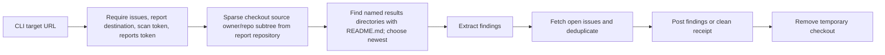
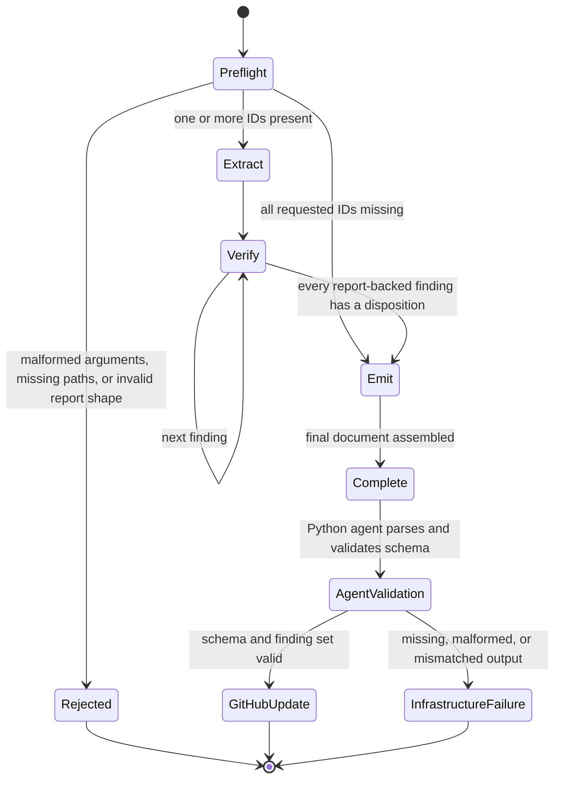

# Runtime views

These views show how the static building blocks collaborate at runtime. They are
source-derived from the Python orchestrators and skill phase instructions.

## Scan runtime

```mermaid
sequenceDiagram
    autonumber
    actor Caller as Operator / scheduler
    participant CLI as agent.__main__
    participant Config as config + auth + token client
    participant Git as git / target repository
    participant Runner as scan runner
    participant SDK as Claude Agent SDK
    participant Skill as /vulnhunt orchestrator
    participant Agents as phase subagents
    participant Results as results directory
    participant Reports as report repository
    participant GH as target GitHub repository
    participant Audit as manifest + audit streams

    Caller->>CLI: python -m agent --mode=scan URL
    CLI->>Config: load TOML, overlay env, validate stage combination
    CLI->>GH: preflight required scan/reports identities
    CLI->>Git: shallow clone (or reuse)
    Git-->>CLI: target checkout
    CLI->>Runner: run_vulnhunt(checkout, policy)
    Runner->>Results: reject prior results; create timestamped directory
    Runner->>Config: refresh inference credential and build sandbox settings
    Runner->>SDK: start strict-tool session
    SDK->>Skill: /vulnhunt + pre-resolved metadata
    Skill->>Agents: Phase 1 recon
    Agents->>Results: phase1_output.md
    Skill->>Agents: 3 class agents per partition + sink-driven agent
    Agents->>Results: partition result files
    Skill->>Agents: Phase 2b adversarial verification
    Agents->>Results: phase2b_output.md
    Skill->>Agents: Phase 3 reproduce, test, fix strategy
    Agents->>Results: PoCs, exploit tests, phase3_output.md
    Skill->>Agents: Phase 3d root-cause sweep
    Agents->>Results: phase3d_output.md
    Skill->>Results: final README.md
    SDK-->>Runner: streamed events and ResultMessage totals
    Runner-->>CLI: newest results directory

    opt publish enabled
        CLI->>Reports: ensure private destination; copy, commit, push report tree
        Reports-->>CLI: publication commit SHA
    end

    opt issues or finding audit enabled
        CLI->>SDK: extract confirmed findings as JSON
        SDK-->>CLI: structured Finding list
    end

    opt issues enabled
        CLI->>GH: ensure labels and list open dedup pool
        CLI->>CLI: match stable vulnfix-key markers
        opt semantic dedup enabled
            CLI->>SDK: compare unmatched findings to bounded issue chunks
            SDK-->>CLI: semantic matches
        end
        CLI->>GH: create one issue per non-duplicate finding
        CLI->>GH: or create/close clean-scan receipt
    end

    CLI->>Audit: emit JSONL lifecycle/finding events
    CLI->>Audit: validate and atomically write scan_manifest.json
    CLI-->>Caller: exit code and paths
```

### Scan invariants

- A scan-mode process receives exactly one target URL.
- A results directory from an earlier run causes the runner to stop rather than let
  the model read its own prior output.
- The results directory is pre-created by Python, and repository metadata is injected
  into the kickoff prompt, allowing Bash to remain hidden for a default scan.
- `tools` and `allowed_tools` receive the same effective list. This both hides other
  SDK tools and auto-approves only the visible tools.
- Bash is stripped from config-supplied tools and added back only for the paired
  `--no-read-only --enable-bash` opt-in.
- A terminal SDK result is not sufficient while phase tasks are pending. The runner
  re-prompts until tasks complete or 60 consecutive continuation cycles show no task
  lifecycle activity.
- Cold-start 429/5xx failures are safe to restart and receive bounded backoff. Once an
  assistant message has appeared, the runner preserves the session and delegates a
  whole-run retry decision to the outer scheduler.
- Issue creation requires a published report URL. The CLI rejects `scan + no-publish +
  issues` before doing work.
- Report fields are LLM-extracted, but PoC and exploit-test paths are discovered from
  the filesystem.
- A scan manifest is schema-validated and atomically committed. Publish failure exit
  code 2 intentionally does not write one.

### Alternate `--no-scan --issues` path



This path permits re-running issue delivery without paying for a new security scan.
Verify mode deliberately does not use "latest"; it stages the exact report directory
named by the source issue marker.

## Fix-verification runtime

```mermaid
sequenceDiagram
    autonumber
    actor Caller as Operator / scheduler
    participant CLI as verify orchestrator
    participant GH as GitHub REST + GraphQL
    participant FS as contained scratch directory
    participant Reports as report repository
    participant RefLLM as configured-model reference extractor
    participant Git as git clone adapters
    participant SDK as Claude Agent SDK
    participant Skill as /vulnhunt-fix-verify
    participant Schema as disposition schema

    Caller->>CLI: --mode=verify issue URLs [--commit SHA]
    CLI->>CLI: parse URLs; enforce one host
    par for each issue
        CLI->>GH: fetch current issue, comments, timeline events
        CLI->>GH: fetch userContentEdits via GraphQL
    end
    CLI->>CLI: reconstruct original bodies and extract original markers
    CLI->>CLI: enforce same repo and results directory
    CLI->>FS: create contained run directory
    CLI->>Git: clone target at HEAD or exact commit
    CLI->>Reports: download exact named report
    CLI->>RefLLM: scan all developer comments for explicit cross-repo references
    RefLLM-->>CLI: requested_sources[]
    loop resolved, allow-listed URL or configured alias
        CLI->>Git: clone additional repository with scoped token attachment
        Git-->>FS: read-only additional checkout
    end
    CLI->>FS: write comments.md with untrusted boundaries and unresolved-hint annotations
    CLI->>SDK: locked Read/Write/Edit/Glob/Grep/Agent session; no Bash or network
    SDK->>Skill: repo, report, finding IDs, output, comments, additional repos
    Skill->>FS: Phase 0 validates paths/report and evaluates R0-R7 claims
    Skill->>FS: phase0_state.json
    alt at least one requested ID exists in report
        Skill->>FS: Phase 1 writes extracted_findings.md
        loop each report-backed finding, optionally parallel
            Skill->>Skill: inspect sink, reachability, class elimination, sweep
            Skill->>FS: disposition_VULN-NNN.json
        end
    else every requested ID is missing
        Skill->>Skill: skip phases 1 and 2
    end
    Skill->>FS: Phase 4 adds INVALID_INPUT stubs and writes verify_disposition.json
    CLI->>Schema: parse and validate disposition v1
    CLI->>CLI: enforce exactly one entry per requested finding
    loop each disposition
        CLI->>GH: post attributed verdict comment
        opt original issue body was edited
            CLI->>GH: archive reconstructed original body
        end
        opt verdict is NOT_FIXED, PARTIAL, or INCONCLUSIVE
            CLI->>GH: reopen unless --no-reopen
        end
    end
    CLI-->>Caller: summary and exit code
```

### Verification input policy

The verify path treats issue bodies and comments as attacker-influenceable:

1. It obtains edit history and reconstructs the original body.
2. It reads machine markers only from that original body.
3. It constrains the results-directory marker to a basename shape and rejects traversal
   tokens.
4. It neutralizes user-supplied copies of trusted boundary markers.
5. It resolves extra repositories only from a URL on an allowed host or an exact
   operator-configured alias; it never guesses a repository.
6. It scopes target-token attachment for additional repositories to authorized path
   prefixes.
7. Inside the skill, R7 rejects directive-like prose first; R6 handles agent-annotated
   unresolved hints; R1–R5 then require locally verifiable citations and treat accepted
   claims only as navigation hints.
8. It schema-validates model output and checks the finding ID set before any GitHub
   mutation.

The configured-model cross-repository preflight is best-effort. An extraction failure yields no extra
checkouts; the verification methodology is expected to classify unsupported claims as
unverifiable.

### Verification-skill state flow



The skill's intermediate artifacts are:

| Artifact | Purpose |
|---|---|
| `phase0_state.json` | Trusted-root identity, report/target metadata, comment-claim outcomes, missing/present IDs, and run-level limitation flags |
| `verify_run.log.md` | Append-only human summary across phases |
| `extracted_findings.md` | Focused report fields, sweep pattern, PoC/test references, and accepted claim hints per finding |
| `disposition_VULN-NNN.json` | One static four-gate verdict for a report-backed finding |
| `verify_disposition.json` | Ordered v1 aggregate, including phase-4 `INVALID_INPUT` stubs |

Phase 2 may read a PoC for original-attack context but deliberately does not read or run
the exploit test. Phase 3 is reserved for future replay. If a delegated finding fails to
produce an artifact, the orchestrator retries it once, then emits an `INCONCLUSIVE` stub
instead of abandoning the whole run.

## Remediation runtime



```mermaid
flowchart TB
    invoke["Invoke /vulnhunter-fix"] --> mode{"Mode detection"}
    mode -->|inside GitHub checkout| inplace["In-place mode"]
    mode -->|target + results outside checkout| fork["Fork mode"]
    mode -->|ambiguous / none| ask["Ask operator; do not guess"]
    ask --> mode

    inplace --> preflight["Local preflight + gh auth/access checks"]
    fork --> preflight
    preflight --> parse["Phase 1: parse issues or report; select and cluster findings"]
    parse --> approve1{"Operator approve / pause"}
    approve1 --> plan["Phase 2: graph context, worker routing, fix plan, projected completeness"]
    plan --> approve2{"Operator approve / pause"}
    approve2 --> worktree["Create per-cluster worktree"]

    subgraph tdd["Phase 3: TDD implementation per finding"]
        exploit["Write exploit demonstration"] --> red["Write security test; capture RED evidence"]
        red --> fix["Implement root-cause fix"]
        fix --> green["Security test GREEN + regression suite"]
        green --> discriminate["Record pre-fix fail / post-fix pass evidence"]
        discriminate --> commit["Commit scoped change"]
    end

    worktree --> exploit
    commit --> approve3{"Operator approve / pause"}
    approve3 --> verify["Phase 4: cluster RED-to-GREEN matrix and repair loop"]
    verify --> sweep["Sweep sibling root-cause instances; revise completeness if needed"]
    sweep --> approve4{"Operator approve / pause"}
    approve4 --> gates["Phase 5: seven mechanical delivery gates"]
    gates --> triage{"FULL/acceptable and gates pass?"}
    triage -->|yes| ready["Ready PR"]
    triage -->|residual risk / review needed| draft["Draft PR or fallback issue"]
    ready --> gh["Push branch, create PR, comment source issues"]
    draft --> gh
```

### Remediation evidence chain


### Delivery gates implemented by `run-gates.py`

| Gate | Fails when |
|---|---|
| 1. Severity mask | Required severity disclosure is missing or inconsistent |
| 2. Body completeness | Required PR/issue sections, conditional sections, or non-placeholder content are absent |
| 3. Scope | Changed files exceed the declared finding/fix scope |
| 4. Idempotency | Stable correlation markers are missing or malformed |
| 5. Anti-merge | Grouped changes exceed the allowed coupling ratio; no-op for ungrouped single-finding delivery |
| 6. Verification table | Evidence rows, graph caller coverage, sidecars, or result linkage are unverifiable |
| 7. Committed test naming | Exploit/verify scaffolds are committed without promotion into the repository's discoverable test convention |

All except Gate 5 must produce at least one invocation. A missing required input or an
empty required route fails closed.

## Process outcomes

### Scan-mode exit codes observed in the CLI

| Code | Meaning at the process boundary | Manifest behavior |
|---:|---|---|
| 0 | Enabled stages completed; may include a clean scan | Written when a results directory exists |
| 1 | General scan failure or no usable results directory; the manifest schema also reserves this for no findings | Written only when a results directory exists |
| 2 | Report publication failed | Intentionally suppressed |
| 3 | Scan/report succeeded but at least one issue post failed | Written |
| 4 | Prior-report download or issues stage failed | Written when a results directory exists |
| 64 | CLI/config usage error discovered after parsing | Not written |
| 130 | Operator interruption | Not written by the top-level handler |

The vendored scan-manifest schema permits only 0–4 and describes code 1 more narrowly
than the top-level exception handler. Consumers should use both manifest presence and
process context rather than infer a complete state machine from the integer alone.

### Verify-mode exit codes

| Code | Meaning |
|---:|---|
| 0 | Valid disposition produced and requested GitHub updates completed, or dry-run succeeded |
| 1 | Infrastructure/input-shape/SDK/schema/posting failure |
| 2 | Bad programmatic argument shape; `argparse` also uses 2 for CLI parse errors |
| 3 | Required GitHub scan identity missing |
| 130 | Operator interruption handled by the outer CLI |
