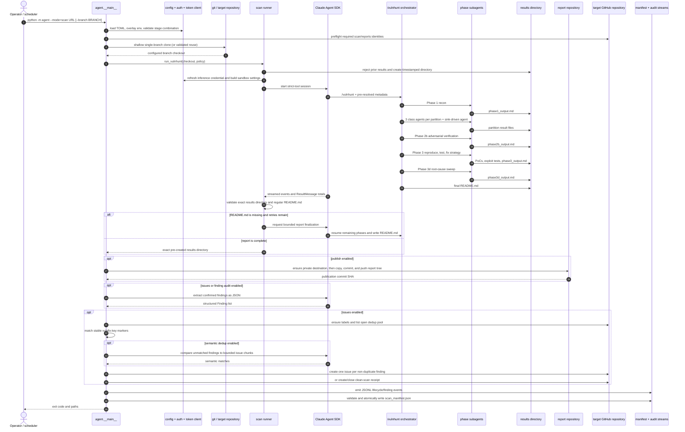
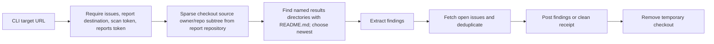
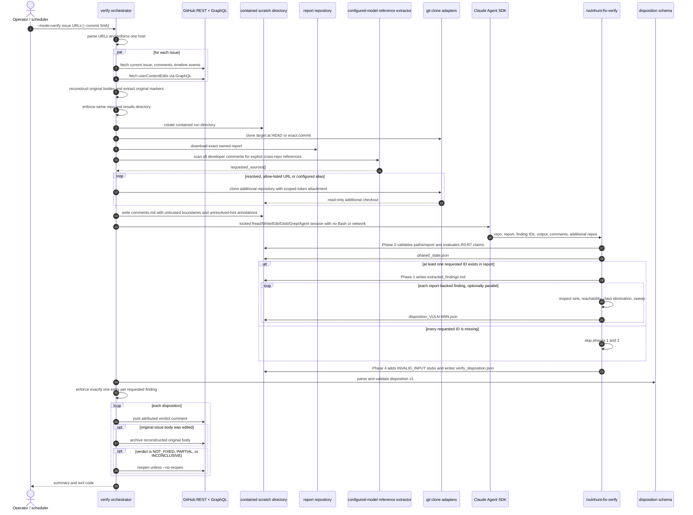
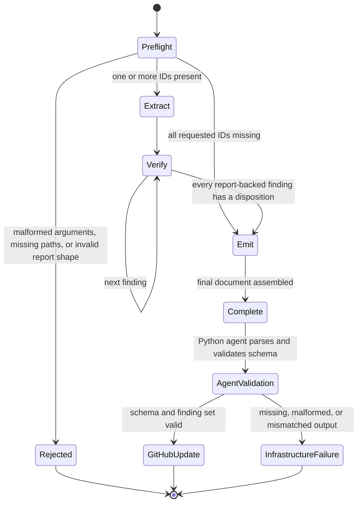
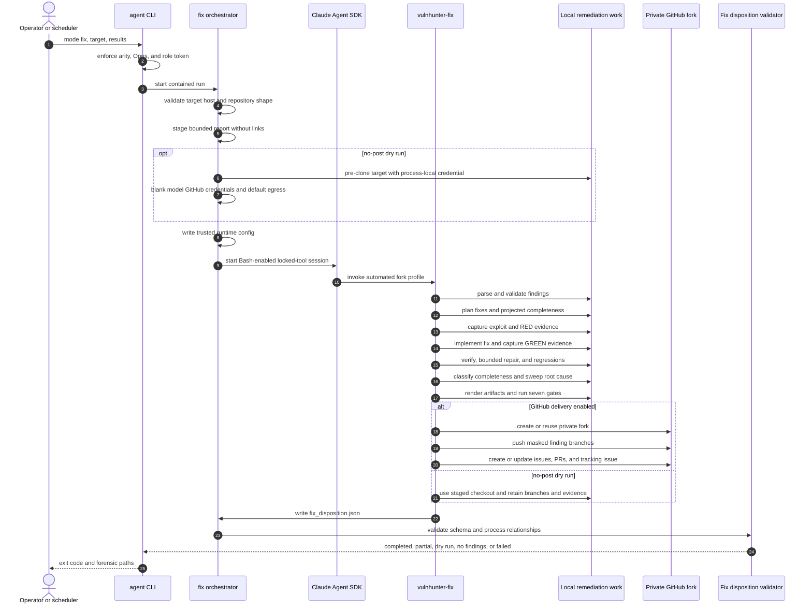

# Runtime views

These views show how the static building blocks collaborate at runtime. They are
source-derived from the Python orchestrators and skill phase instructions.

## Scan runtime



### Scan invariants

- A scan-mode process receives exactly one target URL.
- A results directory from an earlier run causes the runner to stop rather than let
  the model read its own prior output.
- The results directory is pre-created by Python, and repository metadata is injected
  into the kickoff prompt, allowing Bash to remain hidden for a default scan.
- `tools` and `allowed_tools` receive the same effective list. This both hides other
  SDK tools and auto-approves only the visible tools.
- Bash is stripped from config-supplied tools and added back only for the paired
  `--no-read-only --enable-bash` opt-in.
- A terminal SDK result is not sufficient while phase tasks are pending. The runner
  re-prompts until tasks complete or 60 consecutive continuation cycles show no task
  lifecycle activity.
- Cold-start 429/5xx failures are safe to restart and receive bounded backoff. Once an
  assistant message has appeared, the runner preserves the session and delegates a
  whole-run retry decision to the outer scheduler.
- Publishing and issue submission are independent. When publishing is disabled, issue
  bodies point to the retained workflow artifact instead of constructing an invalid
  central-report fragment link.
- Report fields are LLM-extracted, but PoC and exploit-test paths are discovered from
  the filesystem.
- A scan manifest is schema-validated and atomically committed. Publish failure exit
  code 2 intentionally does not write one.

### Alternate `--no-scan --issues` path



This path permits re-running issue delivery without paying for a new security scan.
Verify mode deliberately does not use "latest"; it stages the exact report directory
named by the source issue marker.

## Fix-verification runtime



### Verification input policy

The verify path treats issue bodies and comments as attacker-influenceable:

1. It obtains edit history and reconstructs the original body.
2. It reads machine markers only from that original body.
3. It constrains the results-directory marker to a basename shape and rejects traversal
   tokens.
4. It neutralizes user-supplied copies of trusted boundary markers.
5. It resolves extra repositories only from a URL on an allowed host or an exact
   operator-configured alias; it never guesses a repository.
6. It scopes target-token attachment for additional repositories to authorized path
   prefixes.
7. Inside the skill, R7 rejects directive-like prose first; R6 handles agent-annotated
   unresolved hints; R1–R5 then require locally verifiable citations and treat accepted
   claims only as navigation hints.
8. It schema-validates model output and checks the finding ID set before any GitHub
   mutation.

The configured-model cross-repository preflight is best-effort. An extraction failure yields no extra
checkouts; the verification methodology is expected to classify unsupported claims as
unverifiable.

### Verification-skill state flow



The skill's intermediate artifacts are:

| Artifact | Purpose |
|---|---|
| `phase0_state.json` | Trusted-root identity, report/target metadata, comment-claim outcomes, missing/present IDs, and run-level limitation flags |
| `verify_run.log.md` | Append-only human summary across phases |
| `extracted_findings.md` | Focused report fields, sweep pattern, PoC/test references, and accepted claim hints per finding |
| `disposition_VULN-NNN.json` | One static four-gate verdict for a report-backed finding |
| `verify_disposition.json` | Ordered v1 aggregate, including phase-4 `INVALID_INPUT` stubs |

Phase 2 may read a PoC for original-attack context but deliberately does not read or run
the exploit test. Phase 3 is reserved for future replay. If a delegated finding fails to
produce an artifact, the orchestrator retries it once, then emits an `INCONCLUSIVE` stub
instead of abandoning the whole run.

## Automated fix runtime

`--mode=fix` is the unattended execution profile for the fork remediation workflow.
It deliberately starts in a non-git scratch directory and never automates in-place
changes to a developer checkout.



Automated phase advancement is conditional: the skill records one checkpoint only
after the current phase's required artifacts validate. Missing or malformed artifacts
stop the run. A human-only policy choice is not treated as checkpoint approval; it is
routed to `CANNOT_AUTO_FIX`, `BREAKING_CHANGE`, or `NEEDS_MANUAL_REVIEW`.

For `--no-post`, the Python layer performs the private-repository clone before the SDK
session. The model then gets blank GitHub token variables, a disabled Git credential
helper, and no default GitHub sandbox domains; repository-specific domains remain an
explicit operator configuration.

See [Automated fix-mode architecture](automated-fix-mode.md) for the staging bounds,
tool/credential envelope, disposition semantics, and full equivalence map.

## Interactive remediation runtime

```mermaid
flowchart TB
    invoke["Invoke /vulnhunter-fix"] --> mode{"Mode detection"}
    mode -->|inside GitHub checkout| inplace["In-place mode"]
    mode -->|target + results outside checkout| fork["Fork mode"]
    mode -->|ambiguous / none| ask["Ask operator; do not guess"]
    ask --> mode

    inplace --> preflight["Local preflight + gh auth/access checks"]
    fork --> preflight
    preflight --> parse["Phase 1: parse issues or report; select and cluster findings"]
    parse --> approve1{"Operator approve / pause"}
    approve1 --> plan["Phase 2: graph context, worker routing, fix plan, projected completeness"]
    plan --> approve2{"Operator approve / pause"}
    approve2 --> worktree["Create per-cluster worktree"]

    subgraph tdd["Phase 3: TDD implementation per finding"]
        exploit["Write exploit demonstration"] --> red["Write security test; capture RED evidence"]
        red --> fix["Implement root-cause fix"]
        fix --> green["Security test GREEN + regression suite"]
        green --> discriminate["Record pre-fix fail / post-fix pass evidence"]
        discriminate --> commit["Commit scoped change"]
    end

    worktree --> exploit
    commit --> approve3{"Operator approve / pause"}
    approve3 --> verify["Phase 4: cluster RED-to-GREEN matrix and repair loop"]
    verify --> sweep["Sweep sibling root-cause instances; revise completeness if needed"]
    sweep --> approve4{"Operator approve / pause"}
    approve4 --> gates["Phase 5: seven mechanical delivery gates"]
    gates --> triage{"FULL/acceptable and gates pass?"}
    triage -->|yes| ready["Ready PR"]
    triage -->|residual risk / review needed| draft["Draft PR or fallback issue"]
    ready --> gh["Push branch, create PR, comment source issues"]
    draft --> gh
```



### Remediation evidence chain


### Delivery gates implemented by `run-gates.py`

| Gate | Fails when |
|---|---|
| 1. Severity mask | Required severity disclosure is missing or inconsistent |
| 2. Body completeness | Required PR/issue sections, conditional sections, or non-placeholder content are absent |
| 3. Scope | Changed files exceed the declared finding/fix scope |
| 4. Idempotency | Stable correlation markers are missing or malformed |
| 5. Anti-merge | Grouped changes exceed the allowed coupling ratio; no-op for ungrouped single-finding delivery |
| 6. Verification table | Evidence rows, graph caller coverage, sidecars, or result linkage are unverifiable |
| 7. Committed test naming | Exploit/verify scaffolds are committed without promotion into the repository's discoverable test convention |

All except Gate 5 must produce at least one invocation. A missing required input or an
empty required route fails closed.

## Mythos GitHub Actions runtime

```mermaid
sequenceDiagram
    participant W as Workflow
    participant C as Trusted control plane
    participant G as GitHub
    participant D as Docker and runsc
    participant X as Credential-free canary
    participant A as Mythos agent
    participant P as Egress proxy
    participant AWS as Claude Platform AWS
    participant R as Central reports repository
    participant I as Scanned repository issues
    participant O as Actions artifact

    W->>C: Select claude-mythos-5 and acknowledge retention
    C->>D: Build and launch disposable agent and proxy with runsc
    D-->>C: Attest users namespaces mounts capabilities and read-only roots
    C->>X: Attempt protected writes tmpfs execution and direct HTTP and HTTPS
    X-->>C: Deny protected writes execution and direct egress
    C->>P: Probe HTTP CONNECT IP port and hostname policy
    P-->>C: Deny example.com IP and wrong port; allow exact AWS host on 443
    C->>D: Destroy credential-free canary environment
    C->>G: Clone configured CSV branch with scan token
    C->>C: Build immutable agent and proxy images
    C->>D: Create internal network and runsc container
    D-->>C: Attest runtime network and read-only root
    C->>A: Copy credential-free checkout into tmpfs
    C->>A: Supply AWS workspace credential only
    A->>P: Test denied and allowed CONNECT destinations
    P-->>A: Deny all except exact AWS endpoint on 443
    A->>P: Send inference TLS traffic
    P->>AWS: CONNECT exact regional endpoint
    AWS-->>A: Stream model response through proxy
    A-->>C: Persist scan report in ephemeral workspace
    C->>C: Validate one complete results tree with regular README.md
    C->>C: Export report and trusted source commit
    C->>D: Destroy containers and networks
    opt Publish results enabled
        C->>R: Copy commit and push report with reports token
        R-->>C: Return publication commit
    end
    opt Submit repository issues enabled
        C->>C: Extract and deduplicate findings with no model tools
        C->>I: Create or update issues with scan token
    end
    C->>O: Upload retained report artifact
    C-->>W: Return delivery status
```

The preflight emits sanitized `ISOLATION_PROOF` records to the job log and GitHub step
summary. It receives no AWS or GitHub credentials. The model container never receives
either GitHub token. The scan reuses the checkout staged under its configured clone
directory after validating its branch, loads only installed user settings, and runs
with `--no-publish --no-issues`.
When the SDK becomes idle before the top-level `README.md` exists, the runner requests
bounded report finalization and then fails the scan if the canonical report is still
missing. The launcher exports no partial report and emits no delivery output for a failed
scan. On success, a trusted `--no-scan --results-dir` process revalidates the regular,
non-symlink `README.md` before performing the independently enabled publish and issue
stages. Both workflow controls default to enabled; disabling both leaves artifact upload
as the only delivery route. See the
[Mythos security profile](mythos-security-profile.md) for the complete control and
failure matrix.

## GitHub Actions fix and verify

The manual/reusable fix and verify workflows decompose trusted intake, model execution,
credential-free attestation, and artifact packaging into separate composite actions. Fix
defaults to a local dry run; verify defaults to no comments and no reopen. Both preserve
the agent's exact exit status through always-run evidence collection, then restore failure
at the workflow boundary. Both also accept `claude-mythos-5`, which routes onto a
`gvisor`-labeled runner and moves the model turn into a gVisor container that never
receives a GitHub credential — see
[GitHub Actions remediation and verification § Mythos gVisor execution](github-actions-remediation.md#mythos-gvisor-execution)
for trust boundaries, inputs, secrets, artifacts, and operating procedures.

## Process outcomes

### Scan-mode exit codes observed in the CLI

| Code | Meaning at the process boundary | Manifest behavior |
|---:|---|---|
| 0 | Enabled stages completed; may include a clean scan | Written when a results directory exists |
| 1 | General scan failure or no usable results directory; the manifest schema also reserves this for no findings | Written only when a results directory exists |
| 2 | Report publication failed | Intentionally suppressed |
| 3 | Scan/report succeeded but at least one issue post failed | Written |
| 4 | Prior-report download or issues stage failed | Written when a results directory exists |
| 64 | CLI/config usage error discovered after parsing | Not written |
| 130 | Operator interruption | Not written by the top-level handler |

The vendored scan-manifest schema permits only 0–4 and describes code 1 more narrowly
than the top-level exception handler. Consumers should use both manifest presence and
process context rather than infer a complete state machine from the integer alone.

### Verify-mode exit codes

| Code | Meaning |
|---:|---|
| 0 | Valid disposition produced and requested GitHub updates completed, or dry-run succeeded |
| 1 | Infrastructure/input-shape/SDK/schema/posting failure |
| 2 | Bad programmatic argument shape; `argparse` also uses 2 for CLI parse errors |
| 3 | Required GitHub scan identity missing |
| 130 | Operator interruption handled by the outer CLI |

### Fix-mode exit codes

| Code | Meaning |
|---:|---|
| 0 | Valid `COMPLETED`, `DRY_RUN`, or `NO_FINDINGS` disposition |
| 1 | Staging, SDK, output, schema, semantic, or terminal run failure |
| 2 | Invalid target/results shape in the fix orchestrator |
| 3 | Required GitHub scan identity missing |
| 5 | Valid `PARTIAL` disposition with useful but incomplete work |
| 64 | Top-level CLI/config usage error, including a fix model outside the explicit Opus 4.7, Opus 4.8, and Mythos 5 remediation set |
| 130 | Operator interruption handled by the outer CLI |
