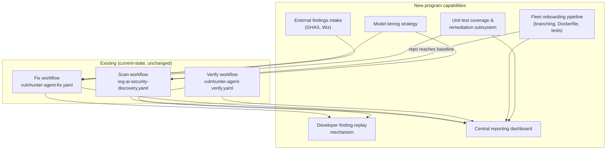

# 1. Program charter & framework alignment

Status: proposed | Depends on: [`docs/architecture/README.md`](../architecture/README.md)

## 1.1 Executive summary

The VulnHunter Enterprise Program extends the existing scan → publish → track →
remediate → verify lifecycle from a single-repository tool into a fleet-wide
capability covering approximately 30,000 repositories, most of which currently
have no unit tests, no Dockerfile, no branch protection, and no way to see their
own security posture except by reading a scan's output directly. The program adds:

1. A **model-tiered inference strategy** — Opus 4.7/4.8 as the default scanning
   baseline, Mythos (or another frontier model) invoked only when a defined
   escalation trigger fires, and lower-cost models performing remediation actions
   once a finding is confirmed.
2. A **unit-test-aware remediation gate** — no security fix ships without evidence
   it resolved the vulnerability *and* did not break existing behavior, verified by
   executing the repository's own test suite (or, where none exists, a
   generated one).
3. A **developer trust mechanism** — every finding issue carries a runnable
   "security unit test" a developer can execute locally to reproduce exactly what
   the agent observed, before trusting (or challenging) the fix.
4. **External findings intake** — GitHub Advanced Security and Wiz findings enter
   the same fix/verify pipeline as VulnHunter's own findings, through a
   normalization layer, so there is one remediation process instead of two.
5. A **fleet onboarding sequence** — branching strategy, Dockerfile baseline, and
   unit-test baseline are established *before* automated remediation is turned on
   for a given repository, because automated fixes are only as safe as the guardrails
   around them.
6. A **central reporting dashboard** — the first place in the organization where
   security posture, test coverage, containerization coverage, and remediation
   velocity are visible at the portfolio level.

## 1.2 Goals

- Discover, remediate, and verify software vulnerabilities across the full
  repository estate with minimal developer involvement, without silently reducing
  the trustworthiness of what ships.
- Keep AI inference spend proportional to risk: expensive frontier-model reasoning
  is reserved for scanning and for cases that need it; routine remediation runs on
  the cheapest model that reliably does the job.
- Make every AI-authored fix independently checkable by a human in minutes, not
  hours — via a replayable test, not just a diff to read.
- Absorb third-party findings (GHAS, Wiz, future tools) into the same governed
  remediation pipeline instead of growing parallel, disconnected fix processes.
- Bring every onboarded repository to a minimum baseline (branch protection, a
  working container build, *some* automated test signal) before enabling
  unattended remediation on it — the automation is not asked to be safer than the
  repository it operates on allows.
- Give engineering leadership, SAFe ARTs, and ITIL change governance one
  authoritative, always-current view of fleet security posture.

## 1.3 Non-goals

- This program does not mandate a single test framework, language, or deployment
  model onto 30,000 repositories. It meets each repository where it is and raises
  its baseline incrementally (see [rollout plan](03-rollout-plan.md)).
- It does not replace human security review for high-severity or ambiguous
  findings — Mythos escalation and mandatory human gates
  (see [reference architecture § 3](02-reference-architecture.md#3-model-tiering-strategy))
  exist specifically because some findings should not be auto-remediated.
- It does not attempt same-day full-fleet coverage. Onboarding is wave-based and
  risk-prioritized (see [rollout plan § 2](03-rollout-plan.md#2-wave-sequencing)).
- It does not build a new ticketing, CI, or source-control system. It builds on
  GitHub, GitHub Actions, and GitHub Issues as they already exist in this
  organization.

## 1.4 Scale and constraints

| Constraint | Implication for program design |
|---|---|
| ~30,000 repositories | Onboarding, scanning cadence, and dashboard aggregation must be wave-based and horizontally parallel, not operator-driven per repo. |
| Nearly every programming language in use | The unit-test subsystem must be built as a pluggable per-language adapter set (see [§4](04-unit-test-coverage-architecture.md)), not a single toolchain. |
| Legacy applications, 20–30 years old | These repositories are the highest-risk and lowest-automatable tier — expect manual Dockerfile/test seeding, longer onboarding waves, and a higher rate of `test_policy=best-effort` or `skip`. |
| Very few repos have unit tests | Remediation cannot universally gate on "tests still pass" until tests exist. The unit-test remediator (§4) must be able to *generate* a minimal security-regression test when none exists, and the program must track "0% coverage" as its own dashboard segment, not hide it inside an average. |
| Very few repos have Dockerfiles | Sandboxed, reproducible test/build execution needs a container. Onboarding seeds a baseline Dockerfile via `docker init` + AI review (see [rollout plan § 4](03-rollout-plan.md#4-dockerfile-onboarding)) before that repo can reach later automation waves. |
| No defined branching strategy; manual deployments | Automated PR delivery needs a target branch with review/merge protection. Branching strategy onboarding via GitHub Rulesets is therefore a **prerequisite wave**, not a parallel effort (see [rollout plan § 3](03-rollout-plan.md#3-branching-strategy-onboarding)). |
| No central reporting today | The dashboard (§5) is new infrastructure, not an extension of an existing one — data model and ingestion must be designed from scratch, sourced from the artifacts the existing pipeline already produces (`scan_manifest.json`, `fix_disposition.json`, `verify_disposition.json` — see [current-state contracts](../architecture/README.md#10-data-and-integration-contracts)). |

## 1.5 Program components at a glance

See [reference architecture](02-reference-architecture.md) for the full end-to-end
diagram and component detail.

## 1.6 Success metrics

Tracked on the [central dashboard](05-central-reporting-dashboard.md); summarized
here as the metrics that define whether the program is working:

| Metric | What it tells us |
|---|---|
| % of fleet onboarded to branch protection | Rollout progress, gate for enabling later automation on a repo |
| % of fleet with a passing container build | Rollout progress, gate for sandboxed test execution |
| % of fleet with unit test coverage > 0% | Rollout progress; the single biggest predictor of remediation-gate strength |
| Mean time to remediate (finding open → verified fixed) | Program effectiveness |
| % of fixes that pass `must-pass` test policy on first attempt | AI remediation quality |
| % of findings with a developer-replayed security test | Developer trust adoption |
| Frontier-model (Mythos) invocation rate vs. Opus-baseline rate | Cost discipline / escalation-policy correctness |
| Inference cost per verified-fixed finding | Cost efficiency trend over time |
| External (GHAS/Wiz) findings ingested vs. remediated through the unified pipeline | Consolidation progress |

## 1.7 Framework alignment

The organization runs Agile/Scrum at the team level, SAFe at the program/portfolio
level, DevSecOps as its delivery philosophy, NIST SSDF (SP 800-218) as its secure
development compliance baseline, and ITIL for service and change governance. This
program is designed to be legible inside all five without inventing a sixth
process model.

### Agile / Scrum

| Program element | Scrum artifact/ceremony |
|---|---|
| A confirmed VulnHunter finding | Backlog item (defect), auto-created as a GitHub Issue — already true today ([current-state issue lifecycle](../architecture/github-actions-remediation.md)) |
| Finding severity + exploitability | Backlog prioritization input, alongside team WSJF/business priority |
| AI-authored fix PR + replayable security test | Ready-for-review artifact; the replay test *is* the acceptance criterion |
| `verify` disposition (`FIXED`/`NOT_FIXED`/`PARTIAL`) | Definition-of-Done check for the backlog item |
| Sprint-level dashboard slice (§5) | Sprint review input: security debt burned down this sprint |
| Unit test coverage delta per PR | Definition-of-Done check: "does not reduce coverage" as a team norm |

### SAFe

| Program element | SAFe construct |
|---|---|
| This program itself | A Value Stream initiative funded as a Program Epic (Security Debt Reduction) |
| Fleet-wide dashboard | Lean Portfolio Management metric, reviewed at Portfolio Sync |
| Wave-based rollout plan (§3 of the rollout doc) | PI (Program Increment) roadmap — each wave sized to fit inside a PI |
| Severity/exploitability-ranked remediation backlog | WSJF-prioritized within each Agile Release Train touching an onboarded repo |
| Onboarding blockers (no tests, no Dockerfile, no branching) | Program-level dependencies/risks tracked on the ART's ROAM board |
| System Demo | Dashboard trendlines presented as the security-posture portion of the demo |
| Inspect & Adapt | Model-tiering cost/quality data and rollout-wave retros feed the I&A workshop |

### DevSecOps

| Program element | DevSecOps principle |
|---|---|
| Scan workflow runs on PR/schedule with no manual trigger | Shift-left, security-as-code |
| The three GitHub Actions workflows themselves | Security-as-code — the pipeline *is* the control, not a document describing one |
| GitHub Rulesets enforced by the onboarding wave | Policy-as-code |
| Verify workflow re-checks closed findings | Continuous verification, not point-in-time audit |
| Unit-test-gated remediation (§4) | "Don't trade one class of defect for another" — security and functional correctness enforced together |
| Developer replay of the security test | Fast feedback loop directly in the developer's own workflow |
| Model tiering | Cost-aware automation — DevSecOps at fleet scale fails economically without this |

### NIST SSDF (SP 800-218)

| SSDF practice | Program element |
|---|---|
| **PO.1** — Define security requirements for software development | Program charter (this document) + per-repo onboarding baseline (branching, Dockerfile, tests) |
| **PO.3** — Implement supporting toolchains | The three VulnHunter workflows, unit-test subsystem, model-tiering config, dashboard — all treated as toolchain components with defined ownership |
| **PO.5** — Implement and maintain secure environments for software development | GitHub Rulesets + branch protection onboarding (rollout §3); sandboxed/gVisor-isolated scan and test execution (existing Mythos profile + new unit-test sandbox, §4) |
| **PS.1 / PS.2** — Protect code from unauthorized access/tampering; verify integrity | Branch protection, required reviews, private-fork delivery for fix mode (existing behavior, [automated-fix-mode.md](../architecture/automated-fix-mode.md)) |
| **PS.3** — Archive and protect software releases | Report publication to the central reports repository (existing) |
| **PW.1 / PW.4** — Define secure-by-design requirements; reuse well-secured software | Container baseline via Dockerfile onboarding; secure-defaults review during AI customization of `docker init` output |
| **PW.6 / PW.7** — Configure compilation/build to improve executable security; review human-readable code | Scan workflow (Opus/Mythos), existing audit skill methodology |
| **PW.8** — Test executable code | Unit test coverage & remediation subsystem (§4) — this is the SSDF practice this program adds the most new capability against |
| **PW.9** — Configure software to have secure settings by default | AI review step of Dockerfile onboarding; security-sensitive coverage scoring (§4) surfaces under-tested hardening code |
| **RV.1** — Identify and confirm vulnerabilities | Scan workflow + external findings intake (GHAS/Wiz normalization) |
| **RV.2** — Assess, prioritize, and remediate vulnerabilities | Fix workflow, model-tiered remediation, unit-test-gated delivery |
| **RV.3** — Analyze vulnerabilities to identify root causes | Existing sweep/root-cause methodology in the remediation skill ([current-state](../architecture/README.md#9-building-blocks)); dashboard trend analysis at fleet scale |

### ITIL

| Program element | ITIL practice |
|---|---|
| This program's business case and charter | Service Strategy / Service Design |
| Wave-based rollout across 30,000 repos | Service Transition — staged release and change enablement |
| A fix PR delivered through the fix workflow | Normal Change, pre-authorized by the program's governance model when `must-pass` gates succeed; Standard Change once a repo's automation track record qualifies it |
| A confirmed VulnHunter (or GHAS/Wiz) finding | Problem record; the underlying vulnerability class is the "problem," each affected instance is an "incident" |
| Scan → Fix → Verify cycle | Event Management (scan) → Change Management (fix) → Problem closure (verify) |
| Central dashboard | Continual Service Improvement register — coverage/adoption trendlines are the CSI input |
| Onboarding blockers per repo | Known Error database equivalent — "this repo cannot yet be automated because X" is tracked, not silently skipped |

## 1.8 Governance

| Role | Responsibility |
|---|---|
| Program owner (security engineering) | Owns this charter, the escalation policy for Mythos/frontier-model use, and go/no-go for enabling automation on a wave |
| Platform/DevOps engineering | Owns the onboarding pipeline (Rulesets, Dockerfile seeding, workflow templates) and the dashboard infrastructure |
| Repository owning teams | Approve/merge fix PRs inside their own change process; own `test_policy` selection for their repo until it reaches `must-pass` maturity |
| SAFe ART leads | Sequence onboarding waves against PI capacity; surface onboarding blockers as ROAM risks |
| ITIL Change Advisory Board | Approves the Normal→Standard Change graduation criteria for automated fix PRs |

## 1.9 Next documents

Continue with the [reference architecture](02-reference-architecture.md) for how
these components fit together technically.
