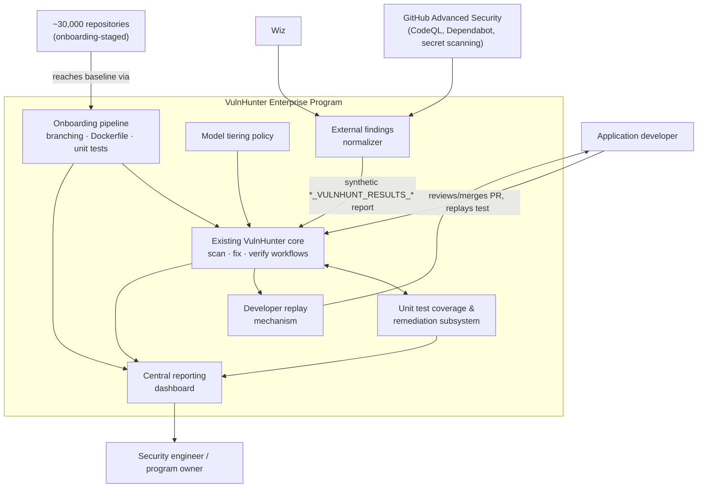
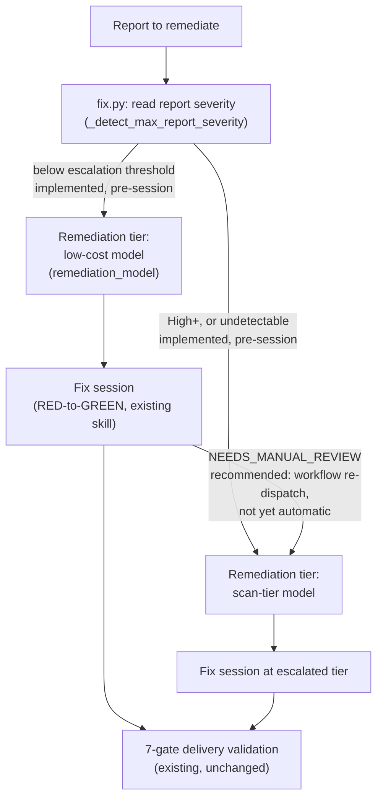
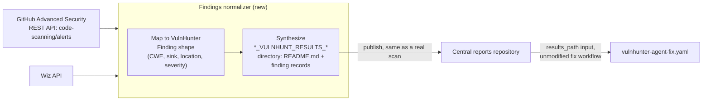
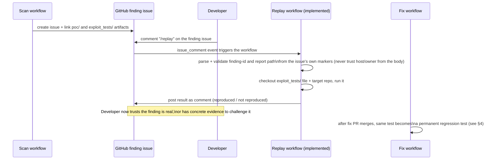

# 2. Reference architecture

Status: proposed | Depends on: [`docs/architecture/README.md`](../architecture/README.md),
[`docs/architecture/github-actions-remediation.md`](../architecture/github-actions-remediation.md)

## 2.1 System context

## 2.2 What stays unchanged

The existing implementation is reused as-is as the per-repository execution
engine. Nothing below requires modification for this program to function:

| Capability | Current-state reference |
|---|---|
| Scan orchestration, audit methodology, PoC/exploit-test generation | [`vulnhunt/SKILL.md`](../../vulnhunt/SKILL.md), [`vulnhunt/phases/`](../../vulnhunt/phases/) |
| Report publication, results-directory contract | [`agent/publish.py`](../../vulnhunter-agent/agent/publish.py), [current-state contracts](../architecture/README.md#10-data-and-integration-contracts) |
| Issue creation/dedup/lifecycle | [`agent/issues.py`](../../vulnhunter-agent/agent/issues.py), [`agent/issues_dedup.py`](../../vulnhunter-agent/agent/issues_dedup.py) |
| Automated fix orchestration, RED-to-GREEN discipline, 7-gate delivery validation | [`docs/architecture/automated-fix-mode.md`](../architecture/automated-fix-mode.md) |
| Four-gate fix verification methodology | [`vulnhunt-fix-verify/SKILL.md`](../../vulnhunt-fix-verify/SKILL.md) |
| Three GitHub Actions workflows and their PAT/GitHub App/AWS-role auth options | [`.github/workflows/README.md`](../../.github/workflows/README.md) |
| Mythos gVisor isolation profile | [`docs/architecture/mythos-security-profile.md`](../architecture/mythos-security-profile.md) |

This program's job is to decide **when** each of these runs, **which model** runs
it, **what happens before and after** it in the fleet lifecycle, and **how the
results are made visible and trustworthy** — not to change how any individual scan,
fix, or verify session itself executes.

## 2.3 Model tiering strategy

### 2.3.1 Scanning tier

| Tier | Model | Default trigger | Notes |
|---|---|---|---|
| Baseline | Claude Opus 4.7/4.8 | Every scheduled and on-demand scan, all repositories | Existing default (`model` input, `claude-opus-4-8`) |
| Escalated | Mythos (`claude-mythos-5`) or another designated frontier model | Any one of the escalation triggers below | Existing `claude-mythos-5` model path already exists and is fail-closed to the gVisor profile; this program adds *when* to choose it, not the isolation mechanism itself |

**Escalation triggers** (any one is sufficient to route a repository/scan to the
escalated tier):

1. **Repository criticality** — repos tagged (via GitHub custom property, see
   [current-state `repo_properties` config](../architecture/README.md#10-data-and-integration-contracts))
   as crown-jewel/regulatory-scope always scan at the escalated tier.
2. **Low-confidence Opus findings** — the Opus scan report contains findings the
   audit skill itself flags as borderline (near the confirmation threshold in its
   verification phase); these are re-run at the escalated tier rather than shipped
   or discarded on Opus's confidence alone.
3. **Post-incident/compliance-triggered deep review** — a specific CWE class or
   repository is flagged for mandatory frontier-model re-scan after an external
   audit, incident, or regulatory finding.
4. **Operator override** — a security engineer can request an escalated scan for
   any repository through the existing `workflow_dispatch` `model` input.

Because Mythos has no safety classifiers and mandatory 30-day request retention
([current-state policy](../architecture/mythos-security-profile.md)), every
escalated run still requires the existing `mythos_retention_acknowledged` input —
this program does not weaken that acknowledgement requirement; the escalation
policy decides *when to ask*, the existing gate still enforces *that someone
answered*.

### 2.3.2 Remediation tier

Today, fix and verify each take their own `model` input and are typically pointed
at the same model as the scan that produced the finding. This program adds a
**separate, cheaper default for remediation**, escalating only when needed:

- **Default**: low-cost model performs remediation for low/medium-severity
  findings.
- **Escalation trigger 1**: report severity is `High+` (the report's own
  vocabulary's most severe tier — see
  [`phase4_report.md`](../../vulnhunt/phases/phase4_report.md)) — routes to the
  scan-tier model.
- **Escalation trigger 2 (recommended, not yet automatic)**: the existing
  `fix.max_repair_attempts` bound ([`agent/config.py`](../../vulnhunter-agent/agent/config.py))
  is exhausted at the low-cost tier, producing a `NEEDS_MANUAL_REVIEW` terminal
  finding outcome ([current-state](../architecture/automated-fix-mode.md#8-terminal-finding-outcomes)).
  Automatically re-running the *entire* fix session at the escalated tier
  before accepting that outcome was deliberately **not** built into `fix.py` in
  this pass — `run_fix()` is a single-shot, bounded orchestration today, and an
  in-process retry risks double-posting delivery artifacts unless designed with
  the same care as the rest of the delivery-gate discipline. The safer, already-
  buildable version of this trigger is a workflow-level re-dispatch (inspect
  the disposition for `NEEDS_MANUAL_REVIEW` findings, re-run with an explicit
  escalated `model`), not a Python-level loop.
- The existing 7-gate delivery validation is model-agnostic and requires no
  change — it validates the *output* regardless of which model tier produced it.

**Implemented** (see [`agent/config.py`](../../vulnhunter-agent/agent/config.py)'s
`AnthropicConfig.remediation_model`/`remediation_escalate_severities`,
[`agent/fix.py`](../../vulnhunter-agent/agent/fix.py)'s `select_fix_model()` and
`_detect_max_report_severity()`): trigger 1 runs *before* the SDK session starts,
not mid-session — `fix.py` reads the staged report's own summary-table severity
column (a documented regex heuristic, not a full parser; an undetectable
severity fails toward the *more* capable model, never toward the cheaper one)
and picks `remediation_model` or `model` accordingly, whenever the caller
leaves `model_override` unset. The workflow/action layer exposes this as
`model: auto` (`.github/workflows/vulnhunter-agent-fix.yaml`,
`.github/actions/run-vulnhunter-fix/action.yml`) — any other explicit `model`
value still always wins over automatic tiering, unchanged from before this
existed.

### 2.3.3 Cost visibility

Every scan/fix/verify session already reports per-turn token usage when
`logging.per_turn_usage` is enabled
([current-state config](../architecture/README.md#12-cross-cutting-concepts)).
This program adds cost tagging by tier (which model actually ran) into the audit
event stream so the dashboard (§5) can report inference cost per verified-fixed
finding, split by tier — the single number that proves or disproves the cost
strategy is working.

## 2.4 External findings intake (GitHub Advanced Security, Wiz)

The existing fix workflow already accepts *any* input that looks like a valid
`*_VULNHUNT_RESULTS_*` directory — `prepare-vulnhunter-fix` validates shape
(a regular `README.md`, no symlinks, an exact `results-path`), not provenance
([`.github/actions/prepare-vulnhunter-fix/action.yml`](../../.github/actions/prepare-vulnhunter-fix/action.yml)).
That means external findings do not need a new fix pipeline — they need a
**normalizer that produces a conforming results directory**, after which the
existing, unmodified fix workflow runs exactly as it would against a VulnHunter
scan's own output.

- The normalizer is a new, independent component — it does not touch the scan,
  fix, or verify workflow code.
- Because no PoC/exploit test exists for a third-party finding, the normalizer's
  synthesized report cannot satisfy the audit skill's own "no PoC, no VULN-NNN ID"
  rule ([`phase4_report.md`](../../vulnhunt/phases/phase4_report.md#L86)) — the fix
  workflow's remediation skill must therefore be able to accept externally-sourced
  findings without a pre-existing PoC, generating its own reproduction test as
  part of the RED-to-GREEN cycle instead of requiring one on intake. This is the
  one genuine behavior change needed in the remediation skill for this feature,
  scoped narrowly to "finding has no `poc/` artifact."
- Findings dedupe against the existing `vulnfix-key` scheme
  ([current-state contracts](../architecture/README.md#10-data-and-integration-contracts))
  so a CodeQL alert and a VulnHunter finding for the same root cause collapse to
  one tracked issue rather than two.

## 2.5 Developer finding-replay mechanism

The audit skill already writes a runnable exploit test per finding —
`exploit_tests/test_vuln_NNN.*` alongside `poc/VULN-NNN_*.md`
([`phase3_reproduce_test.md`](../../vulnhunt/phases/phase3_reproduce_test.md)) —
and the report already links each finding to both files
([`phase4_report.md`](../../vulnhunt/phases/phase4_report.md)). Today that artifact
lives only inside the results directory. This program surfaces it directly on the
finding issue and makes it one-click runnable:

**Implemented**: [`config/onboarding/replay-finding.yml.template`](../../config/onboarding/replay-finding.yml.template).
A few details the diagram above simplifies:

- **It's an `issue_comment` trigger, not `workflow_dispatch`.** GitHub has no
  native "button on an issue" mechanism; a `/replay` slash command is the
  closest native equivalent, and it's genuinely one click/keystroke for the
  developer. This also means the workflow file must live **in each target
  repository** (issue events only fire for the repo the workflow lives in) —
  it's a deployable template like the Wave 1 onboarding templates, not a
  centrally-dispatched workflow like scan/fix/verify.
- **The issue body is untrusted input, treated accordingly.** It's developer-
  editable, and the report link it contains is a plain URL an editor could
  alter. The workflow parses that URL for *path* information only
  (finding ID, results directory) — the *host and repository* it clones from
  is always the operator-configured `VULNHUNT_REPORTS_REPOSITORY_SLUG`
  repository variable, never whatever the issue body claims. A URL pointing
  anywhere else is rejected outright (a documented, tested rejection path —
  this is exactly the confused-deputy shape `verify`'s existing
  `allowed_clone_hosts`/`token_path_prefixes` guards defend against
  ([current-state contracts](../architecture/README.md#10-data-and-integration-contracts)),
  applied to a new entry point).
- **Authorization**: only commenters with `OWNER`/`MEMBER`/`COLLABORATOR`
  association can trigger it — this executes repository code, so the same
  trust bar as who can push, not "anyone who can see the issue."
- **No model inference**, confirmed by the implementation, not just the
  design intent — it locates and executes a file, nothing more.
- **Sandboxing today is "an ephemeral GitHub-hosted runner," not yet
  "the repository's Wave-2 container."** Wave 2 (Dockerfile onboarding) isn't
  built in this pass — wiring replay execution into a repository's actual
  container is a documented follow-up, not a current gap in the workflow's own
  logic. Language dispatch (Python via pytest, JS via `node`, `sh`, Go, Ruby,
  PHP) is best-effort; an exploit test in any other language is surfaced with
  instructions to run it manually rather than silently skipped.
- Replay only becomes available once a repository has an onboarded, sandboxable
  test execution environment (§3/§4) — for repositories still in early onboarding
  waves, the issue instead links the PoC markdown for manual review, same as
  today.
- After a fix PR merges, the same `exploit_tests/test_vuln_NNN.*` file is what the
  unit-test remediator (§4) commits into the repository's permanent test suite —
  "replay the finding" and "the regression test that proves it stays fixed" are
  the same artifact at two points in its life, not two separate systems to build.

## 2.6 Unit test integration point

Full design in [§4](04-unit-test-coverage-architecture.md). At the architecture
level, the integration point is `fix.test_policy`
([existing config](../../vulnhunter-agent/agent/config.py)) — already
`best-effort | must-pass | skip` — and the RED-to-GREEN discipline already built
into the remediation skill
([current-state](../architecture/automated-fix-mode.md)). This program adds:

- A pre-fix **coverage assessment** step that determines whether `must-pass` is
  even achievable for a given repository (does it have a working test command at
  all?), feeding the onboarding wave gating in [§3 of the rollout plan](03-rollout-plan.md#2-wave-sequencing).
- A **security-regression-test generator** for repositories with no existing tests
  for the affected code path, so `test_policy` can move toward `must-pass` even in
  repositories that started with zero coverage.
- **Security-sensitive coverage scoring**, so "tests pass" and "the security-
  relevant code path is actually exercised" are reported as distinct dashboard
  signals rather than collapsed into one pass/fail bit.

## 2.7 Fleet onboarding and dashboard connection

Onboarding (branching, Dockerfile, unit tests — [§3](03-rollout-plan.md)) is a
prerequisite pipeline that gates which repositories are eligible for which
capability. The dashboard (§5) is a pure consumer: it reads the existing
`scan_manifest.json`, `fix_disposition.json`, and `verify_disposition.json`
artifacts (unchanged schemas) plus new onboarding-status and coverage records —
it does not sit in the critical path of any scan/fix/verify run.

## 2.8 Cross-cutting concerns at fleet scale

### Security

- The external-findings normalizer and the replay workflow both follow the
  existing trusted-control-plane pattern (credentials never enter a
  model-facing sandbox; see [current-state security concepts](../architecture/README.md#12-cross-cutting-concepts)) —
  no new trust boundary is introduced, only new producers/consumers of the
  existing artifact contracts.
- Replay execution runs untrusted, repository-controlled test code — it inherits
  the same sandboxing requirement as the existing scan/fix sandbox
  (bwrap + socat, or the Mythos gVisor profile for repositories that need it).

### Cost

- Model tiering (§2.3) is the primary cost control. The dashboard's per-tier cost
  metric is the feedback loop that lets the program owner tune escalation
  triggers instead of guessing.
- Replay (§2.5) is inference-free by design, so developer trust-building does not
  scale inference cost with developer engagement.

### Reliability at 30,000-repository scale

- Every new component (normalizer, replay workflow, onboarding pipeline) is
  designed to be horizontally parallel and stateless between repositories — no
  component holds fleet-wide state in memory; the dashboard's data store is the
  only place fleet-wide state accumulates.
- Existing per-run reliability behavior (bounded retries, partial-failure exit
  codes — [current-state reliability](../architecture/README.md#12-cross-cutting-concepts))
  is unchanged and is what the dashboard's "stuck/failed" metrics are built on.

## 2.9 Next documents

- [Rollout plan](03-rollout-plan.md) for how repositories reach the baseline this
  architecture assumes.
- [Unit test coverage & remediation architecture](04-unit-test-coverage-architecture.md)
  for the full design of §2.6.
- [Central reporting dashboard](05-central-reporting-dashboard.md) for how all of
  the above becomes one fleet-wide view.
