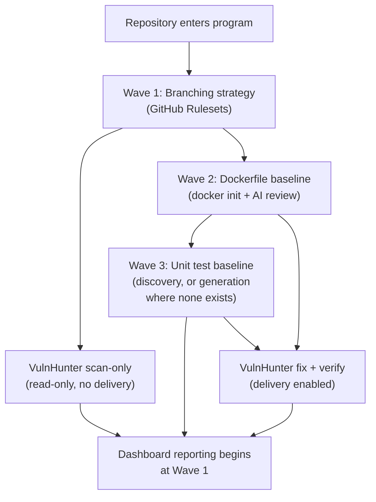

# 3. Rollout plan

Status: proposed | Depends on: [01-program-charter.md](01-program-charter.md),
[02-reference-architecture.md](02-reference-architecture.md)

## 3.1 Principle: automation is only as safe as the repository it runs against

A repository with no branch protection, no build, and no tests is not a safe
target for unattended AI remediation — not because the AI is untrustworthy, but
because there is nothing to catch a mistake. Every wave in this plan exists to
put a specific guardrail in place *before* the capability that depends on it is
turned on. Onboarding is therefore modeled as a **dependency graph, not a
checklist**:

**Scanning starts as early as Wave 1** — a scan is read-only and needs only a
place to publish issues to, which branch protection makes safe to do without risk
of an issue-bot commit landing anywhere. **Delivery (fix PRs) does not start until
Wave 3** — an AI-authored PR is only trustworthy to merge automatically once there
is a build and a test signal to gate it against.

## 3.2 Wave sequencing

| Wave | Capability enabled | Prerequisite | Owner |
|---|---|---|---|
| 0 | Repository inventory + classification (language, criticality, legacy flag, owning team) | None | Platform engineering |
| 1 | Branch protection (GitHub Rulesets) + VulnHunter **scan-only** mode | Wave 0 | Platform engineering, repo owning team |
| 2 | Dockerfile baseline (`docker init` + AI review) | Wave 1 | Platform engineering, repo owning team |
| 3 | Unit test baseline (discovery or generated minimum) | Wave 2 | Unit test remediator (automated), repo owning team review |
| 4 | VulnHunter **fix** enabled, `test_policy=best-effort` | Wave 3 | Security engineering |
| 5 | VulnHunter **verify** enabled + developer replay | Wave 4 | Security engineering |
| 6 | `test_policy` graduates to `must-pass` where coverage supports it; external findings intake (GHAS/Wiz) connected | Wave 5, sustained track record | Security engineering, ITIL CAB (Standard Change graduation) |

Repositories move through waves independently — there is no fleet-wide "everyone
finishes Wave 1 before anyone starts Wave 2." A given repository's wave is a
dashboard field (§5), and waves are the primary lens the dashboard uses to
summarize rollout progress.

### Prioritization within a wave

Given 30,000 repositories, no wave processes the whole fleet at once. Order
within a wave by:

1. **Internet-facing / crown-jewel repositories first** — highest risk, highest
   value from early scan coverage even before delivery is enabled.
2. **Highest recent change velocity next** — active repositories accumulate new
   vulnerabilities fastest and benefit most from continuous scanning.
3. **Legacy/dormant repositories last, on a separate track** (§3.6) — lowest
   change velocity means lowest urgency, and they require the most manual
   onboarding effort per repository.

## 3.3 Branching strategy onboarding (Wave 1)

Goal: every repository has a protected default branch and a defined path for
changes to land, so that (a) VulnHunter can safely open issues without confusion
about which branch is authoritative, and (b) later fix-mode PRs have a real
review gate to land against.

Two onboarding mechanisms, chosen per repository based on how much the team
already has in place:

1. **GitHub Rulesets applied centrally** — for repositories that already use a
   reasonable default-branch model, a central onboarding workflow applies a
   standard Ruleset (required PR review, required status checks, block force-push
   and branch deletion) without touching repository content.
2. **Central seeding workflow** — for repositories with no defined branching
   strategy at all (the common case per the program's stated constraints), a
   one-time workflow:
   - Creates/confirms a `main` (or team-approved default) branch.
   - Seeds standard repository templates: CODEOWNERS, PR template, a minimal
     CI workflow stub.
   - Applies the same standard Ruleset as above.
   - Opens a single onboarding PR the team reviews and merges on their own
     schedule — onboarding never force-pushes over a team's existing history or
     workflow.

Repositories that decline or delay onboarding remain on the dashboard as
"blocked at Wave 1," visible to the program owner and the owning team's SAFe
ART, rather than silently excluded from reporting.

## 3.4 Dockerfile onboarding (Wave 2)

Two-step approach, matching the starter approach already defined for this
program:

1. **`docker init`** generates starter Dockerfile, `.dockerignore`, and
   (where applicable) `compose.yaml` for the detected language/framework.
2. **AI review and customization** — a scoped model pass (low-cost tier, per
   [§2.3.2](02-reference-architecture.md#232-remediation-tier)) reviews the
   generated files against the actual repository (correct base image, actual
   dependency manifest, correct entrypoint/build steps for frameworks
   `docker init` doesn't fully auto-detect) and against a secure-defaults
   checklist (non-root user, no baked-in secrets, minimal base image, pinned
   versions) — this is the same review discipline as
   [NIST SSDF PW.9](01-program-charter.md#nist-ssdf-sp-800-218), applied to the
   onboarding artifact itself rather than only to application code.

The onboarding PR is opened the same way as branching onboarding — team-reviewed,
team-merged, never force-landed. A repository that cannot be containerized as-is
(rare, but expected among legacy applications) is flagged for the legacy track
(§3.6) rather than blocking the wave for every other repository.

**Why this wave matters beyond containerization**: the Dockerfile baseline is
what makes sandboxed, reproducible test execution possible for Wave 3 — the unit
test subsystem ([§4](04-unit-test-coverage-architecture.md)) runs build/test
commands inside this container, both for coverage assessment and for the
developer replay mechanism ([§2.5](02-reference-architecture.md#25-developer-finding-replay-mechanism)).

## 3.5 Unit test baseline onboarding (Wave 3)

Full subsystem design in
[§4](04-unit-test-coverage-architecture.md). At the rollout-plan level, Wave 3
has two distinct outcomes depending on what the repository starts with:

| Starting state | Wave 3 outcome |
|---|---|
| Existing test suite, detectable framework | Coverage assessment runs, baseline coverage score recorded, no code changes needed to complete the wave |
| No test suite | Unit test remediator generates a minimal scaffold (framework setup + one smoke test) so a `test` command exists and returns a real pass/fail signal — this is a floor, not a target; coverage-improvement remediation continues indefinitely afterward as its own ongoing workstream, not a one-time wave |
| Test suite exists but doesn't run cleanly (broken build, missing fixtures) | Flagged for the legacy track (§3.6); Wave 4/5 delivery stays gated at `test_policy=skip` for this repository until resolved |

## 3.6 Legacy/exception track

20–30 year old applications are explicitly expected to fail the standard
onboarding path for at least one wave. Rather than blocking the whole repository
from any program benefit, the legacy track:

- Enables **scan-only mode indefinitely** if branching onboarding succeeds but
  Dockerfile/test onboarding cannot (partial program value is still real value).
- Records the specific blocker per repository (no buildable Dockerfile, no
  runnable test command, unsupported/EOL language toolchain) as a tracked,
  visible item — the ITIL "Known Error" equivalent referenced in the
  [charter](01-program-charter.md#17-framework-alignment) — rather than a silent
  gap in dashboard coverage.
- Routes to manual security engineering effort for the highest-criticality
  legacy repositories, since automation genuinely cannot reach every one of
  30,000 repositories at acceptable cost or safety.

## 3.7 VulnHunter workflow onboarding (Waves 1, 4, 5)

Once a repository reaches the prerequisite wave, enabling the corresponding
VulnHunter workflow is mechanical — add the repository to
[`config/repos.csv`](../../config/repos.csv) (scan) and configure the
`vulnhunter-fix`/`vulnhunter-verify` environments per
[`.github/workflows/README.md`](../../.github/workflows/README.md) (fix/verify).
No new capability is needed here beyond fleet-scale automation of that
enrollment step itself — this is the one piece of this rollout plan best served
by a small platform-engineering tool (a "repo state" reconciler that keeps
`repos.csv` and environment membership in sync with each repository's actual wave)
rather than new VulnHunter architecture.

## 3.8 Risk register

| Risk | Impact | Mitigation |
|---|---|---|
| A team merges a Dockerfile/branching onboarding PR without review, introducing a broken build or insecure default | Wasted onboarding effort, possible false sense of security | Onboarding PRs are never auto-merged; AI review checklist is documented in the PR description for human reviewers, not hidden |
| Unit test scaffold generation produces tests that pass trivially without exercising real behavior | False confidence in `test_policy=must-pass` graduation | Coverage assessment (§4) reports security-sensitive coverage separately from raw pass/fail; graduation to `must-pass` requires a minimum coverage score, not just "tests exist and pass" |
| Legacy repositories never reach delivery-enabled waves, becoming permanent scan-only blind spots for remediation | Residual unremediated findings at the highest-risk tier | Legacy track routes highest-criticality blocked repositories to manual security engineering rather than leaving them purely automated-and-stuck |
| Fleet-wide rollout velocity is throttled by review capacity on owning teams, not by automation capacity | Program timeline slips independent of technical readiness | Wave progress is tracked per team on the dashboard (§5), visible to SAFe ART leads for capacity planning, per the [charter's governance model](01-program-charter.md#18-governance) |
| A repository's onboarding wave silently regresses (e.g. branch protection removed after onboarding) | Delivery-enabled automation continues running against a now-unsafe repository | Onboarding status is re-verified, not just recorded once — the dashboard (§5) treats wave status as a live measurement, not a one-time badge |

## 3.9 Next document

[Unit test coverage & remediation architecture](04-unit-test-coverage-architecture.md)
for the full design referenced throughout §3.5.
