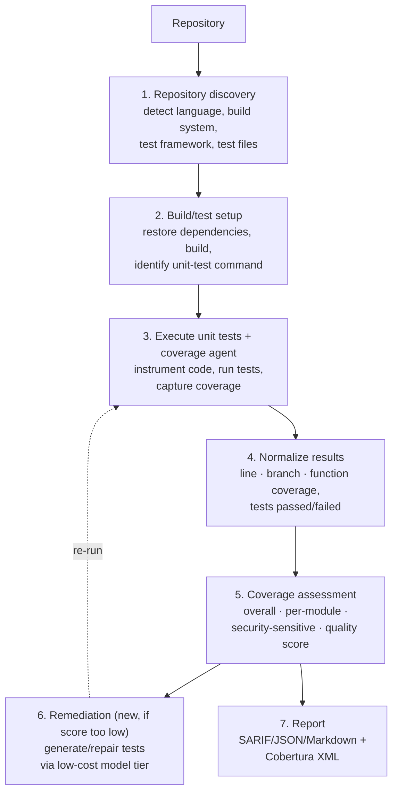
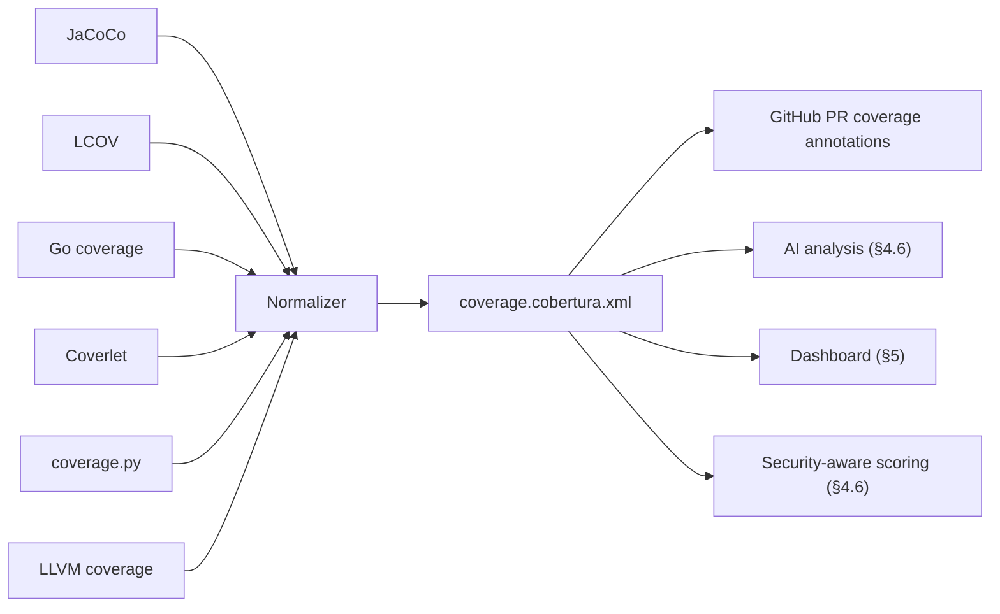
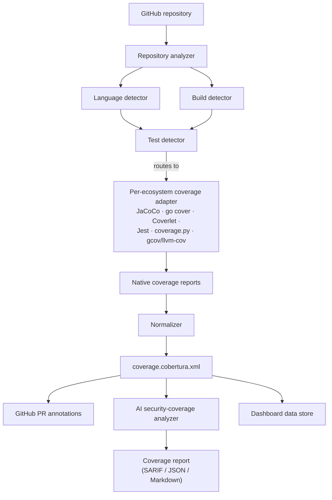

# 4. Unit test coverage & remediation architecture

Status: proposed | Depends on: [02-reference-architecture.md § 2.6](02-reference-architecture.md#26-unit-test-integration-point),
[03-rollout-plan.md § 3.5](03-rollout-plan.md#35-unit-test-baseline-onboarding-wave-3)

A scanner can tell you a test *file* exists. Only running the tests, with
instrumentation, tells you what code they actually exercise. This subsystem does
both: static discovery first, then real execution with coverage capture — and
then goes one step further than a normal coverage tool by connecting the result
back to VulnHunter's own security findings.

## 4.1 Pipeline



Steps 1–5 are the assessment pipeline; step 6 is what makes this a *remediation*
subsystem rather than a reporting tool, closing the loop with the model-tiering
strategy in [§2.3.2](02-reference-architecture.md#232-remediation-tier).

## 4.2 Static repository discovery

Before executing anything, inspect the repository to determine language, build
system, and test framework:

| Language | Indicators | Typical unit test framework |
|---|---|---|
| Java | `pom.xml`, `build.gradle` | JUnit, TestNG |
| C#/.NET | `.sln`, `.csproj` | xUnit, NUnit, MSTest |
| JavaScript/TypeScript | `package.json` | Jest, Vitest, Mocha |
| Python | `pyproject.toml`, `pytest.ini`, `requirements.txt` | pytest, unittest |
| Go | `go.mod`, `*_test.go` | Go testing |
| C/C++ | `CMakeLists.txt`, `Makefile` | GoogleTest, Catch2 |
| Rust | `Cargo.toml` | `cargo test` |

Output of this phase (per repository):

```json
{
  "languages": ["Java", "JavaScript"],
  "build_systems": ["Maven", "npm"],
  "test_frameworks": ["JUnit", "Jest"],
  "test_files": 147,
  "source_files": 893,
  "coverage_supported": true
}
```

This tells us whether tests appear to exist — not how much source they actually
cover. That requires step 3.

## 4.3 Execute coverage using each ecosystem's native tooling

| Ecosystem | Command | Native output | Notes |
|---|---|---|---|
| Java | `mvn test` (JaCoCo instrumentation enabled) | `jacoco.xml` — LINE, BRANCH, INSTRUCTION, METHOD, CLASS | |
| Go | `go test ./... -coverprofile=coverage.out` then `go tool cover -func=coverage.out` | Per-function + total statement coverage | Coverage is built into the Go toolchain — the easiest ecosystem to automate |
| .NET/C# | `dotnet test --collect:"XPlat Code Coverage"` (Coverlet) | `coverage.cobertura.xml` | Already Cobertura-shaped natively |
| JavaScript/TypeScript | `npx jest --coverage` | `coverage/lcov.info`, `coverage/clover.xml`, `coverage/coverage-final.json` | Prefer the machine-readable report over parsing console output |
| Python | `coverage run -m pytest && coverage xml` | `coverage.xml` (Cobertura-compatible) | |
| C/C++ (GCC) | `gcov` + `lcov` | LCOV format | |
| C/C++ (Clang) | `-fprofile-instr-generate -fcoverage-mapping`, then `llvm-cov` | LLVM coverage format | |

## 4.4 Normalize to one interchange format

Downstream consumers (dashboard, AI analysis, GitHub PR annotations) should not
each need to understand JaCoCo, LCOV, Coverlet, Go's profile format, and LLVM
coverage separately. The subsystem normalizes every ecosystem's native output to
**Cobertura XML** as the canonical interchange format:



Cobertura is a deliberate choice beyond "one format is simpler than six": GitHub's
native code-coverage functionality ingests Cobertura XML directly and can
annotate pull requests and compare against the default branch without any custom
tooling on our side.

## 4.5 Report more than a headline percentage

A bare "unit test coverage: 78%" is not actionable. The assessment step produces:

```
UNIT TEST COVERAGE ASSESSMENT

Overall line coverage:       78.4%
Branch coverage:             64.2%
Function coverage:           81.7%

Unit tests discovered:       384
Unit tests executed:         378
Passed:                      376
Failed:                      2
Skipped:                     6

Source files:                924
Files with coverage:         811
Files with 0% coverage:      113
```

broken down per module:

```
Module                        Line       Branch
------------------------------------------------
authentication               92%         87%
authorization                88%         74%
payments                     63%         42%
database                     79%         67%
API                          84%         71%
cryptography                 37%         21%
utilities                    91%         88%
```

## 4.6 Security-aware coverage

An overall coverage number can hide exactly the gaps that matter most for an
AppSec program. The assessment layer identifies security-sensitive functions —
authentication, authorization, input validation, deserialization, cryptography,
file operations, database queries, command execution, network operations,
secrets handling, privilege operations — and scores their coverage separately:

```
Overall line coverage:          78%
Security-sensitive coverage:    46%
High-risk branch coverage:      31%
```

This is the single most important addition this subsystem makes over a generic
coverage tool, and it is what makes the security-sensitive functions list
directly consumable by [model-tiered remediation](02-reference-architecture.md#232-remediation-tier):
a low security-sensitive coverage score on a module is exactly the signal that
should route that module's remediation to a higher model tier or a mandatory
human review, even if the finding severity alone would have routed it to the
low-cost tier.

## 4.7 Separate unit tests from integration/functional/e2e tests

Running `mvn verify` or `npm test` unfiltered can silently fold integration-test
coverage into what's reported as unit coverage. The discovery phase identifies
test category from:

- **Directory conventions** — `/test`, `/tests`, `/unit`, `/integration`, `/e2e`.
- **File naming** — `*Test.java`, `*UnitTest.java`, `*.spec.ts`, `*.test.ts`,
  `*_test.go`.
- **Framework configuration** — pytest markers, JUnit tags, Maven
  Surefire/Failsafe split, Gradle test tasks, Jest projects.

Execution targets the unit-test portion specifically wherever the repository's
own metadata makes that distinguishable; where it can't be distinguished, the
assessment report says so explicitly (`test_scope: "mixed, could not isolate unit
tests"`) rather than silently reporting a blended number as if it were pure unit
coverage.

## 4.8 Sandboxed execution requirement

Coverage execution necessarily runs repository-controlled build scripts and test
code. This is untrusted execution in exactly the same sense as the existing
Claude Code tool sandbox
([current-state security concepts](../architecture/README.md#12-cross-cutting-concepts)):

- Runs inside the repository's onboarded container
  ([Dockerfile baseline, rollout §3.4](03-rollout-plan.md#34-dockerfile-onboarding-wave-2)),
  on an ephemeral, isolated runner/job — never on a long-lived host.
- No credentials beyond what the build itself needs (e.g. a scoped, read-only
  package-registry token) are present in that execution context, following the
  same credential-isolation pattern already used for Mythos's model container
  ([mythos-security-profile.md](../architecture/mythos-security-profile.md)).
- Repositories flagged for the [legacy/exception track](03-rollout-plan.md#36-legacyexception-track)
  because their build cannot be safely sandboxed are excluded from automatic
  coverage execution rather than run with weaker isolation.

## 4.9 Enterprise-scale component architecture



Every adapter in this diagram runs inside the sandboxed execution environment
described in §4.8 — the diagram omits that boundary for readability, not because
it's optional.

## 4.10 Scoring model

A single line-coverage percentage is not the score. The composite score is:

```
Unit Test Score =
    40% Line Coverage
  + 25% Branch Coverage
  + 15% Function Coverage
  + 10% Critical/Security-Sensitive Component Coverage
  + 10% Test Health (executed/passed ratio)
```

Worked example:

| Component | Raw value | Weighted contribution |
|---|---|---|
| Line coverage | 82% | 32.8 |
| Branch coverage | 61% | 15.25 |
| Function coverage | 87% | 13.05 |
| Security-sensitive coverage | 47% | 4.7 |
| Test health | 96% | 9.6 |
| **Unit Test Score** | | **75.4** |

Classification bands:

| Score | Classification |
|---|---|
| 90–100 | Excellent |
| 80–89 | Strong |
| 70–79 | Moderate |
| 50–69 | Weak |
| 0–49 | Critical |

This score, not raw line coverage, is what gates `fix.test_policy` graduation
from `best-effort` to `must-pass`
([rollout plan § 3.5](03-rollout-plan.md#35-unit-test-baseline-onboarding-wave-3))
and is a first-class field on the [central dashboard](05-central-reporting-dashboard.md).

**Report coverage regression, not just an absolute threshold.** GitHub's coverage
functionality supports comparing PR coverage against the default branch and can
enforce thresholds on pull requests directly — the program should use both: an
absolute floor per repository's onboarding wave, and a "this PR must not lower
the Unit Test Score" regression check on every PR, security-fix or otherwise.

## 4.11 Security unit test remediator and validator

Two new roles, both running at the [low-cost remediation model tier](02-reference-architecture.md#232-remediation-tier)
by default, escalating per the same rules as vulnerability remediation:

**Remediator** — when a repository has zero or insufficient coverage over the
code path a confirmed VulnHunter (or externally-sourced) finding touches:

1. Generates a minimal, framework-appropriate test scaffold if none exists at all
   (ties to [rollout plan Wave 3](03-rollout-plan.md#35-unit-test-baseline-onboarding-wave-3)).
2. Converts the finding's existing `exploit_tests/test_vuln_NNN.*` artifact
   ([existing audit-skill output](../../vulnhunt/phases/phase3_reproduce_test.md))
   into a permanent test committed alongside the fix — this is the same artifact
   the [developer replay mechanism](02-reference-architecture.md#25-developer-finding-replay-mechanism)
   uses before the fix lands; after the fix lands, it becomes the regression test
   proving the fix stays fixed.
3. Where the finding came from external intake with no PoC/exploit test
   ([§2.4](02-reference-architecture.md#24-external-findings-intake-github-advanced-security-wiz)),
   generates one as part of the RED-to-GREEN cycle before proceeding — this is the
   same narrow remediation-skill extension already noted in the reference
   architecture.

**Validator** — runs as part of the existing verify workflow's evidence
gathering, not as a new workflow:

- Confirms the fix resolves the vulnerability (existing four-gate verification,
  unchanged).
- **Additionally** confirms the full unit test suite still passes and the Unit
  Test Score did not regress — "the fix didn't break functionality" becomes a
  measured verification gate, not an assumption.
- A fix that resolves the vulnerability but fails this check is not silently
  merged — it returns to the remediation loop
  ([reference architecture § 2.3.2](02-reference-architecture.md#232-remediation-tier))
  for another attempt, escalating model tier per the existing
  `fix.max_repair_attempts` bound before surfacing a human checkpoint.

## 4.12 Output contract

Following the repository's existing pattern of versioned, schema-validated
artifacts ([current-state contracts](../architecture/README.md#10-data-and-integration-contracts)),
this subsystem's report is a new artifact type — `coverage_assessment.json` v1 —
alongside the Cobertura XML, SARIF, and Markdown renderings, so the dashboard and
any future consumer validate against a stable shape instead of re-deriving
meaning from prose.

## 4.13 Next document

[Central reporting dashboard](05-central-reporting-dashboard.md) for how the
Unit Test Score and coverage-assessment artifact roll up into the fleet-wide
view.
