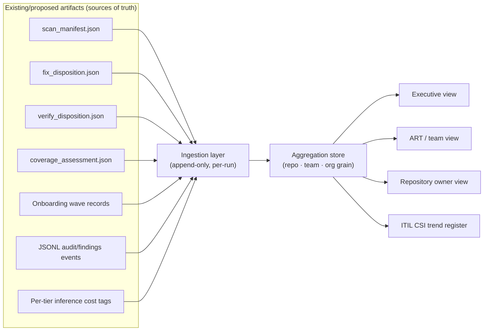

# 5. Central reporting dashboard

Status: proposed | Depends on: all prior documents in this set

There is no central reporting today — this is new infrastructure, not an
extension of an existing one. It is designed as a pure read-side consumer of
artifacts the rest of the program already produces, so it never sits in the
critical path of a scan, fix, verify, or onboarding run.

## 5.1 Design principle

Every metric on this dashboard traces to a specific artifact already defined
elsewhere in this program or in the current-state system — nothing here invents
a new source of truth:

- **Ingestion is append-only per run** — a new scan, fix, verify, coverage, or
  onboarding event adds a record; nothing is mutated in place, so the dashboard
  can always answer "what did we know at time X," not just "what's true now."
- **Aggregation happens at three grains**: repository (raw), team/owning-group
  (roll-up), and organization (portfolio). SAFe ART and ITIL CAB consumers work
  at the team/portfolio grain; individual developers and repo owners work at the
  repository grain.

## 5.2 Metrics catalog

### Security findings

| Metric | Grain | Source |
|---|---|---|
| Open findings by severity | Repo, team, org | `scan_manifest.json`, issue state |
| Findings by CWE class, trended over time | Team, org | `scan_manifest.json` history |
| Mean time to remediate (open → verified fixed) | Repo, team, org | Issue open timestamp → `verify_disposition.json` `FIXED` timestamp |
| Findings by source (VulnHunter vs. GHAS vs. Wiz) | Repo, team, org | Finding provenance field (new, from [external intake normalizer](02-reference-architecture.md#24-external-findings-intake-github-advanced-security-wiz)) |
| Verify disposition distribution (`FIXED`/`NOT_FIXED`/`PARTIAL`/`INCONCLUSIVE`) | Repo, team, org | `verify_disposition.json` |

### Unit test coverage

| Metric | Grain | Source |
|---|---|---|
| Unit Test Score (composite, [§4.10](04-unit-test-coverage-architecture.md#410-scoring-model)) | Repo, team, org | `coverage_assessment.json` |
| Line / branch / function coverage | Repo, team, org | `coverage_assessment.json` |
| Security-sensitive coverage | Repo, team, org | `coverage_assessment.json` |
| % of fleet with coverage > 0% | Team, org | `coverage_assessment.json` presence |
| Coverage regression flags (PR lowered Unit Test Score) | Repo | Per-PR `coverage_assessment.json` diff |

### Dockerfile / container coverage

| Metric | Grain | Source |
|---|---|---|
| % of fleet with a passing container build | Team, org | Onboarding wave records |
| % of fleet at Wave 2+ (Dockerfile onboarded) | Team, org | Onboarding wave records |

### Branching / ruleset adoption

| Metric | Grain | Source |
|---|---|---|
| % of fleet with GitHub Ruleset applied | Team, org | Onboarding wave records + live GitHub Ruleset state (re-verified, not just recorded once — see [rollout plan risk register](03-rollout-plan.md#38-risk-register)) |
| % of fleet at Wave 1+ | Team, org | Onboarding wave records |

### Remediation velocity and quality

| Metric | Grain | Source |
|---|---|---|
| Fix attempts per finding (and repair-loop escalation rate) | Repo, team, org | `fix_disposition.json` |
| % of fixes passing on first attempt | Team, org | `fix_disposition.json` |
| % of fixes at `must-pass` vs. `best-effort` vs. `skip` policy | Repo, team, org | `fix_disposition.json` |
| Delivery gate failure reasons (which of the 7 gates fails most) | Team, org | `fix_disposition.json` |

### Model tiering and cost

| Metric | Grain | Source |
|---|---|---|
| Scan-tier distribution (Opus vs. Mythos/frontier) | Team, org | Audit event tier tag |
| Remediation-tier distribution (low-cost vs. escalated) | Team, org | Audit event tier tag |
| Escalation trigger frequency (which trigger fired) | Org | Audit event tier tag + trigger reason |
| Inference cost per verified-fixed finding, by tier | Team, org | Audit event tier tag + per-turn usage |

### External findings intake

| Metric | Grain | Source |
|---|---|---|
| Findings ingested by source tool | Team, org | Normalizer output |
| % of external findings remediated through the unified pipeline vs. handled outside it | Team, org | Normalizer output + `fix_disposition.json` |

### Developer engagement

| Metric | Grain | Source |
|---|---|---|
| % of findings with at least one developer replay | Repo, team, org | Replay workflow event log |
| Replay pass/fail split (did it reproduce?) | Repo, team, org | Replay workflow event log |

### Rollout / onboarding progress

| Metric | Grain | Source |
|---|---|---|
| Repository count by wave (0–6) | Team, org | Onboarding wave records |
| Repositories blocked, by blocker type | Team, org | Legacy/exception track records ([rollout plan § 3.6](03-rollout-plan.md#36-legacyexception-track)) |
| Wave progression rate (repos/week moving to next wave) | Team, org | Onboarding wave records, trended |

## 5.3 Example views

| View | Primary audience | Emphasis |
|---|---|---|
| Executive / portfolio | Program owner, security leadership | Org-grain trendlines: open findings by severity, MTTR, % fleet onboarded per wave, cost per verified-fixed finding |
| SAFe ART / team | ART leads, engineering managers | Team-grain: wave status of owned repos, blocked-repo list, sprint-level security-debt burn-down |
| Repository owner | Individual developers, repo maintainers | Repo-grain: open findings, Unit Test Score, this repo's onboarding wave and next blocker, replay history |
| ITIL CSI register | Change Advisory Board | Trendlines only — coverage and adoption over time, feeding the continual-improvement review referenced in the [charter](01-program-charter.md#17-framework-alignment) |

## 5.4 Data freshness and source-of-truth discipline

- Every metric above is computed from an artifact that already has a defined
  producer and (where applicable) a JSON Schema — the dashboard does not
  introduce a second, informal definition of "coverage" or "fixed" that could
  drift from what the pipeline itself considers true.
- Onboarding-wave state is **re-verified**, not cached indefinitely — a
  repository whose branch protection was removed after onboarding shows that
  regression on the dashboard rather than continuing to report a stale "Wave 1
  complete" badge (see [rollout plan risk register](03-rollout-plan.md#38-risk-register)).
- The dashboard's own outage or lag never blocks a scan, fix, verify, onboarding,
  or replay run — it is a consumer, never a dependency, of the pipeline it
  reports on.

## 5.5 This completes the current document set

Return to the [program README](README.md) for the full document index, or the
[program charter](01-program-charter.md) for how this dashboard's metrics map
back to the governance frameworks this program is built to satisfy.
